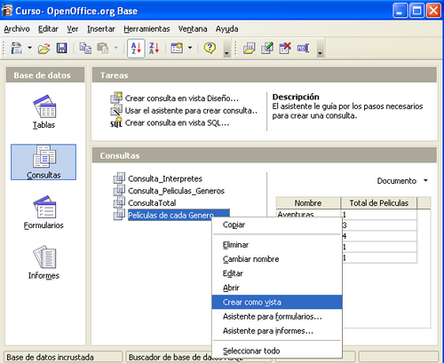
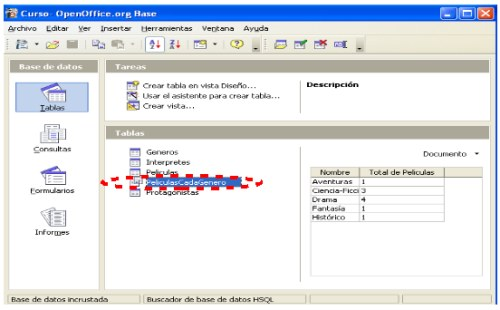
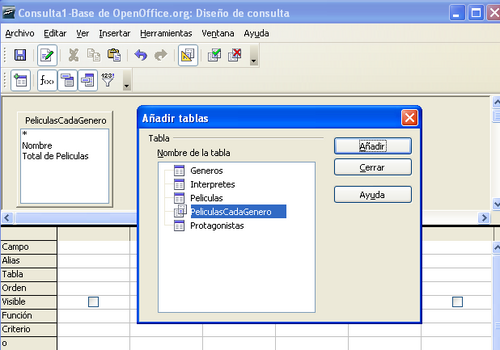
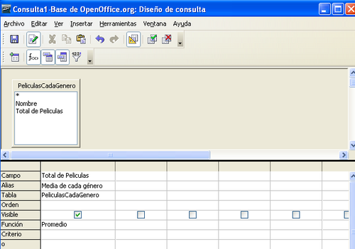
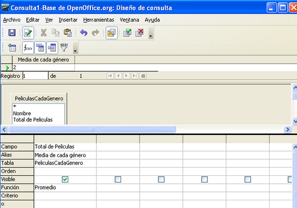

# 6.3 Vistas. Consultas sobre vistas 

## ¿Qué son las vistas?

Las vistas son un tipo especial de consultas almacenadas que, a nivel de bases de datos, se tratan como una tabla más. 

¿Qué ocurre si necesitamos realizar una consulta no sobre una tabla sino sobre los resultados de otra consulta? 

La respuesta es que debemos convertir la consulta en una vista para que se pueda manejar como si de una tabla se tratara. 

## Cantidad de películas de cada género

Para ver las beneficios de usar vistas, vamos a realizar una consulta que nos devuelva el valor medio de las películas asociadas a cada género. 

Esta consulta no se puede realizar directamente sobre las tablas Generos y Peliculas sino sobre la consulta Películas de cada Género una vez convertida en vista.

##  Convertir una consulta en una vista

Para convertir una consulta en una vista nos situamos en la ventana principal  en la **sección Consultas** y: 

- Seleccionamos la consulta que queramos convertir con el botón derecho del ratón. 
- Del menú que se despliega seleccionamos la opción “Crear como vista”. 

Se nos despliega entonces una ventana donde tenemos que poner un nombre a la vista, escribimos **PeliculasCadaGenero** y aceptamos. Ya hemos convertido la consulta en una vista y podemos ver que ya es así si nos situamos en la sección “Tablas” de la ventana principal . Podemos observar que se usa un icono distinto para representar vistas y distinguirlas de las tablas. 

## Crear una consulta sobre la vista

Una vez que ya tenemos la vista, vamos a crear una consulta sobre ella. Para empezar, vemos que al entrar en vista Diseño para crear una nueva consulta ya nos aparece **PeliculasCadaGenero** como si de una tabla más se tratara y la elegimos como única tabla de la consulta. 

Como sólo queremos que nos devuelva el valor medio de las películas de cada género seleccionamos el campo Total de Peliculas y le asociamos la función **Promedio** junto con el alias “Media de cada género”. 

Para ver que la consulta hace lo que esperamos en la propia vista Diseño , la lanzamos antes de guardarla utilizando el botón **Ejecutar** y, si devuelve el valor esperado, ya hemos terminado. 

