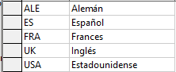
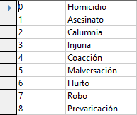

# 9. BD delicuentes

## Base de datos de los delincuentes más buscados 

Realizado una base de datos para el FBI con los datos de los delincuentes más peligrosos.

 Se deben incluir los siguientes objetos: 

## 1. Tabla denominada DELINCUENTES con los siguientes campos: (0.75 puntos)

- Nº registro preso (clave primaria) 
- Nombre 
- Apellidos
- Fecha de nacimiento 
- Fotografía (tipo imagen)
- DNI/Pasaporte 
- ¿Está en la cárcel actualmente?

Rellena la tabla con al menos 10 registros

## 2. Tabla denominada CONDENAS con estos campos (0.75 puntos): 

- Nº Registro de condena (clave primaria) 
- Identificación del preso 
- Fecha de entrada 
- Fecha de salida 
- Prisión (Alcatraz, Guantánamo o Sing Sing). Este campo si queréis lo podéis sacar a otra tabla.
- Tiempo de condena (mejor en meses, a fin de que sea un número entero)

Rellena la tabla con al menos **8 condenas**.

## 3. Vamos a crear 2 tablas adicionales. Separa en tablas diferentes esta información: (1 punto)

Tabla nacionalidad. Una idea de tabla podría ser:

Tabla actividad delictiva. Una idea de tabla podría ser:

Piensa que necesitarás crear o modificar columnas en la tabla delincuentes para relacionar estas nuevas tablas.

No paséis a relaciones hasta que tengáis al menos estas cuatro tablas

## 4. Crea las relaciones que tu creas necesarias, teniendo en cuenta: (1,5 puntos)

Un delincuente puede tener varias actividades delictivas

Una actividad delictiva puede corresponder a varios delincuentes

## 5. Diseña las siguientes consultas: (2 ptos.) 

### A. Consulta "delincuentes_USA"

Delincuentes de nacionalidad estadounidense (Nombres y apellidos) 

### B. Consulta "delincuentes_70s"

Delincuentes nacidos entre los años 1960 y 1970. (Nombre, apellido y fecha de nacimiento)

### C. Consulta "delincuentes_afganistan_irak"

Delincuentes que viven en Afganistán e Irak. 

### D. Consulta "delincuentes_por_nacionalidad"

Número de delincuentes por nacionalidad. 

### D. Consulta "delincuentes_por_nacionalidad"

### E. Crea una consulta "condenas_delincuentes" que genere los siguientes resultados:

## 6. Realiza un formulario que nos permita introducir y actualizar información sobre delincuentes  y otro formulario para insertar condenas (1 punto)

## 7. Diseña los siguientes informes:  (1,5 puntos)

Si necesitáis usar dos tablas para un informe, necesitaréis primero crear una consulta a partir de esas tablas, y a continuación crear un informe con esa consulta como fuente de datos.

Si tenéis que filtrar una tabla, necesitaréis en primer lugar crear una consulta, que sí nos permite establecer criterios para filtrar, y a continuación crear un informe a partir de los datos que genere esta consulta.

a) Delincuentes. 
b) Delincuentes agrupados por prisión. 
c) Delincuentes agrupados por actividad delictiva
d) Delincuentes condenados por robo

## 8. Conclusiones y dificultades encontradas (1 punto)

