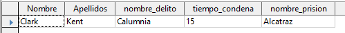

# 5. Consultas

Una vez tenemos todas las relaciones, podremos crear consultas sobre varias tablas que utilicen valores de ambas, así como restricciones. Deberéis crear las siguientes consultas:

## A. Consulta "delincuentes_USA"

Delincuentes de nacionalidad estadounidense (Nombres y apellidos)

## B. Consulta "delincuentes_70s"

Delincuentes nacidos entre los años 1960 y 1970. (Nombre, apellido y fecha de nacimiento)

## C. Consulta "delincuentes_afganistan_irak"

Delincuentes que nacidos en Afganistán o Irak.

## D. Consulta "delincuentes_por_nacionalidad"

En esta consulta deberéis ofrecer una tabla que muestre cuantos delincuentes hay por cada nacionalidad. Por ejemplo:

- Españoles 2
- Franceses 3
- Estadounidenses 1

Necesitaréis utilizar **funciones**.

## E. Crea una consulta "condenas_delincuentes" que genere los siguientes resultados:

(2 ptos)