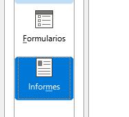

# 7. Informes

Si necesitáis usar dos tablas para un informe, necesitaréis primero crear una **consulta** a partir de esas tablas, y a continuación crear un **informe** con esa consulta como fuente de datos.

- Delincuentes
- Delincuentes agrupados por prisión. 
- Delincuentes agrupados por actividad delictiva
- Delincuentes condenados por robo

(1,5 puntos)
