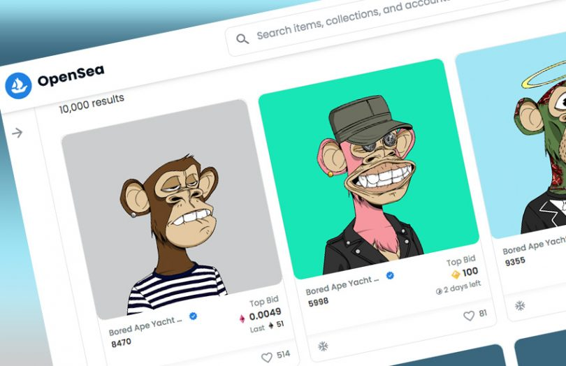

# NFT

¿Qué pasaría si pudiéramos crear activos digitales similares a Bitcoin, pero con un identificador único en cada unidad? Esto haría que cada uno fuera único, lo que significa que no sería fungible. Esta característica es lo que define a un NFT, que no puede ser replicado o transferido sin el permiso del propietario, ni siquiera por el creador.

## Aplicaciones

Esto ha abierto la puerta a nuevas formas de usar los activos digitales, permitiendo a los usuarios crear y vender obras de arte digital únicas, almacenar recuerdos exclusivos como videos y fotos, e incluso utilizarlo como una forma de inversión, como Bitcoin.

Esto significa que si **posees un NFT**, tienes un activo único que puedes vender a alguien más si deseas obtener beneficios, al igual que ofrece un  mayor nivel de flexibilidad a los creadores para establecer sus propias reglas sobre cómo se pueden transferir los activos.

## Marketplaces

Un mercado de NFT (marketplace) es una plataforma en la que puedes comprar y vender NFTs. Algunos de los principales mercados de NFT son OpenSea, Rarible y Nifty Gateway.

- Dichos mercados conectan a los compradores con los vendedores
- En ellos el valor de cada token es único.
- NFT son propensos a los cambios de precio como respuesta a la oferta y demanda del mercado

## ¿Pero cómo es posible que algo así tenga valor?

 El valor es un concepto **subjetivo y relativo**. Se refiere a la apreciación o estimación que alguien hace de algo. Por lo tanto, hay muchos factores que determinan el valor de algo, incluyendo la demanda, la oferta, la utilidad, la rareza, el costo de producción, el costo de adquisición y el estado de conservación.

El valor de los coleccionables digitales es igual al de cualquier otro artículo preciado, y se asigna por la gente que lo considera **valioso**. Esto se debe a que **el valor es una creencia compartida**, y no importa si se trata de dinero fíat, metales preciosos o un vehículo, todos estos objetos adquieren su valor porque la gente cree que lo tienen. Por lo tanto, los coleccionables digitales no son diferentes.

## Wallets

Una cartera (**wallet**) es la herramienta imprescindible para poder conectar al marketplace (opensea), mintear un trabajo, pagar comisiones, recibir dinero, etc.

Además, hay que tener **Ethereums** para iniciar una cuenta y crear una colección, pero se deben pagar comisiones para hacer esto.

## Garantías

- NFT no garantiza nada
- No garantiza la propiedad intelectual
- No hay garantía de copyright

## ¿Qué hace la gente que compra NFTs?

Algunos los ven como una inversión, ya que su valor puede aumentar con el tiempo. Hay gente que compra NFTs para utilizarlos como coleccionables, como si fueran trading cards. Otros los usan como representaciones de activos digitales, como terrenos en videojuegos o mundos virtuales. Algunos incluso los usan como obras de arte digitales.

## ¿Cómo se crean los NFT?

 Los NFT se pueden crear utilizando una variedad de plataformas de desarrollo de contratos inteligentes, como Ethereum, EOS, TRON, etc. Los desarrolladores necesitan diseñar un contrato inteligente y luego codificarlo en un lenguaje de programación como Solidity, Vyper o Javascript. Una vez codificado, el contrato inteligente se sube a la cadena de bloques para que los usuarios puedan crear, almacenar y transferir tokens NFT.