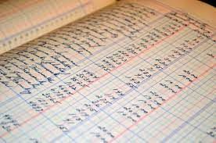
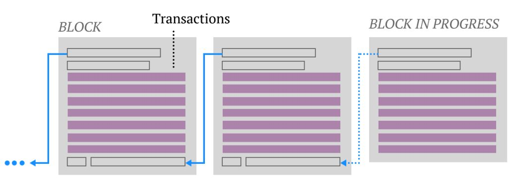
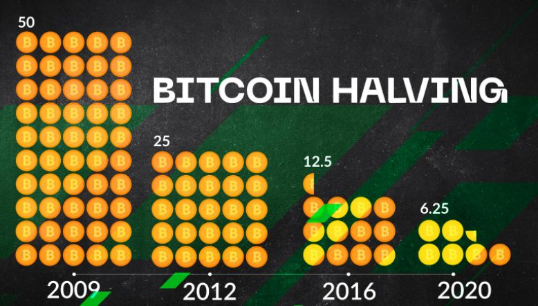
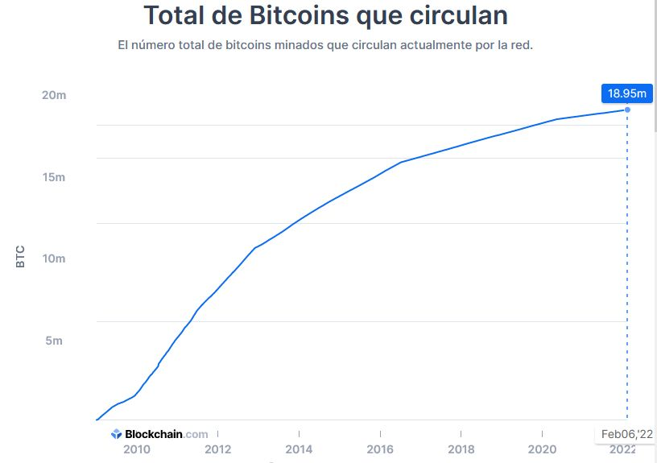

## Bitcoin. La criptomoneda más popular

¿Cual es el origen?
- Bitcoin es un conjunto de tecnologías, así como el nombre de la moneda
- El sistema es de código abierto
- Desde 2009. Creado Satoshi Nakamoto (individuo/grupo anónimo)

## Funcionamiento

- Se basan en la tecnología blockchain
- La información económica se guarda en un libro de cuentas
- Este libro se distribuye entre múltiples nodos repartidos por Internet
- El libro se divide en bloques
- Los bloques se une entre ellos formando una cadena (Blockchain)

## ¿Quién controla el sistema?

- Bitcoin lo controlan todos los usuarios de Bitcoin del mundo.
- Los programadores mejoran el software
- No pueden forzar un cambio en el protocolo de Bitcoin
- Usuarios son libres de elegir el software y la versión que quieran.
- Para que sigan siendo compatibles entre sí, todos los usuarios necesitan utilizar software que cumpla con las mismas reglas.

## Bitcoin. Explicación técnica

- Libro de contabilidad (ledger)
- El libro de contabilidad es público
- Contiene la historia de todas las transacciones de bitcoin desde 2009
- Los nodos comparten información y crean bloques, manteniendo toda la estructura de bitcoin
- La red comienza a funcionar el 3 de Enero de 2009, con el bloque génesis

https://academy.bit2me.com/que-es-bloque-genesis/

## La cadena blockchain

- Este libro está formado por bloques
- Cada bloque contiene un conjunto de transacciones
- Cada 10 minutos de media se crea un bloque nuevo
- Este bloque, si se confirma, se añade al libro (cadena)
- Cada bloque contiene una referencia al bloque anterior
- Se puede rastrear cada transacción desde 2009

## Dónde se guarda todo esto

- Este libro se guarda en muchos ordenadores
- Estos PC que tienen un software ejecutándose
- Los PC que son nodos completos tienen la cadena de bloques completa (400 GB)
- Si un ordenador está apagado, cuando se reinicie, enviará un mensaje para obtener los bloques creados cuando la computadora estaba inactiva.
- Tamaño actual de blockchain es de 400 GB

# Cómo se lleva la contabilidad
Por lo general, pensamos que una transacción tiene un débito y un crédito (contabilidad de doble entrada)
Con Bitcoin, hay una tercera entrada. Cada transacción va a un depósito de conocimiento común.
Este repositorio o libro mayor público es altamente seguro y lo mantienen todos en la red.
El libro público es la última palabra, por lo que no puede haber desacuerdo sobre los débitos y créditos y no puede haber "gastos dobles".
El libro mayor público se llama "cadena de bloques"

# Seguridad. Clave pública y privada

La creación de una "cuenta bancaria" en la red global de Bitcoin genera una contraseña extremadamente larga, también conocida como "clave privada". Esta es imposible de adivinar para nadie más.

Cualquiera, en cualquier lugar con acceso a Internet, puede recibir, enviar y mantener Bitcoin utilizando la versión pública de su clave.  Se puede compartir libremente para recibir fondos de forma segura

## Bitcoin

- ¿Dónde están mis bitcoin?
- ¿Cuántos bitcoin hay?
- ¿Cómo se crean?

## ¿Cuántos bitcoin se obtienen por crear un bloque?

- Las monedas se van creando poco a poco.
- Cada vez que se crea un bloque se generan bitcoin
- Actualmente cada 10 minutos se crean 6.25 bitcoin
- Se ingresan en la cuenta del minero que crea el bloque correcto

## ¿Cuántos bitcoin existen?

- La producción se ralentiza con el tiempo
- La cantidad de nuevas monedas se divide por la mitad cada 4 años
- En **2140** se estima que se habrán creado todos los bitcoin
- El máximo de monedas que habrá serán **21.000.000 de bitcoin**. Ni más ni menos.

