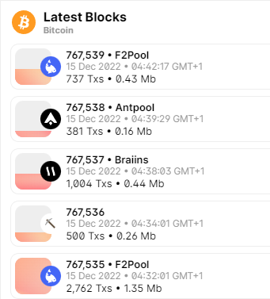

# Creación de un bloque

Cuando se tiene un conjunto de **transacciones**, los mineros compiten por crear un **bloque válido**, el cual contiene un hash, una copia de la cadena de bloques anterior y el hash de la transacción raíz, así como información adicional como el número de confirmaciones al bloque, el tiempo de creación del bloque, etc.

Una vez que el bloque es creado, se confirma y se añade a la cadena de bloques, sucediendo esto cada diez minutos de media.

Si miramos el bloque superior, vemos que está conformado por **737** transacciones. En este caso, **F2Pool** es quien ha minado este bloque con éxito.

## Pools

Los **Pools** de ``Bitcoin`` son grupos de mineros que se unen para aumentar la probabilidad de encontrar un bloque y recibir una recompensa. Los mineros comparten su **potencia de procesamiento** y reciben una porción proporcional de la recompensa según la cantidad de trabajo que realizan.

Además, los mineros a menudo comparten los costos relacionados con los equipos de minería y electricidad a compartir. El objetivo de los pools de minería es maximizar la tasa de éxito de los mineros al encontrar un bloque.

## Recompensa al crear un bloque

Si su bloque sale adelante, las transferencias de dentro se confirman, y se lleva la recompensa.
Las recompensas van disminuyendo cada 4 años (50,25, 12.5, 6.25, etc).
A día de hoy (octubre de 2021) existen alrededor de 700.000 bloques creados

## Identificación de bloques

- El 3 de enero de 2009 se crea el primer bloque.
- Los bloques tienen un número que los identifica.
- El bloque original es el bloque 0.
- En este bloque, la primera transacción es una cantidad de ``Bitcoin``s creados nuevos a su cuenta.

## Cadena de bloques (blockchain)

Los bloques se colocan uno encima del otro, formando una pila.
Cada bloque nuevo está formado a partir de información del anterior
Esta cadena de bloques se llama blockchain
Toda esta información, que ocupa actualmente 400GB, se guarda en múltiples ordenadores
Estos ordenadores se llaman nodos, y se van intercambiando la información
Bitcoin existe mientras todos estos nodos guardan copias de la información
