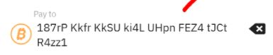
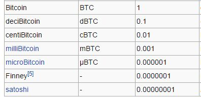

## Cuentas bancarias

- No existe una cuenta tradicional, como una cuenta bancaria donde el banco puede consultar su saldo
- En un banco tradicional creamos una cuenta bancaria
- Con ese número podemos realizar pagos y recibir dinero.
- Esta cuenta a nuestro nombre, vinculada a nuestro DNI.
- El banco guarda la información sobre la cuenta, así como las operaciones que se han realizado

## Cuenta en bitcoin

Cada persona crea al menos una dirección. Una dirección de Bitcoin es un identificador de **33 caracteres** que representa una cuenta de Bitcoin. Las direcciones se generan usando una clave privada, que es un número aleatorio de 32 bytes.

Aquí podéis ver las 3 direcciones de bitcoin con mayor cantidad de monedas en la actualidad. La primera de ellas contiene cerca de 250.000 bitcoin, lo que supone alrededor del 1,3% de monedas existentes a dia de hoy. (https://bitinfocharts.com/top-100-richest-bitcoin-addresses.html)

Cada dirección de bitcoin tiene un asocidadas un par de claves: una pública y otra privada, que nunca revelaremos a nadie.

## ¿Podemos comprar bitcoin?

Puedes comprar bitcoin a través de **exchanges** online o a través de plataformas de peer-to-peer.

- Los **exchanges** en línea funcionan de manera similar a las bolsas de valores tradicionales, donde compras y vendes bitcoin a través de una plataforma. La principal diferencia es que los exchanges en línea operan 24/7, lo que te permite comprar y vender bitcoin en cualquier momento.
- Las **plataformas de peer-to-peer**, por otro lado, conectan directamente a compradores y vendedores. Esto significa que puedes comprar y vender bitcoin directamente de otras personas.

- Podemos comprar bitcoin con euros, y venderlo a cambio de euros
- El tipo de cambio varía con el tiempo.
- Las personas que minan un bloque con éxito (mineros), se “autotransfieren” una cantidad fija de la nada

¿Existen unidades más pequeñas que un bitcoin?

