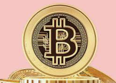
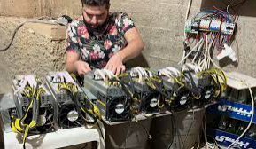
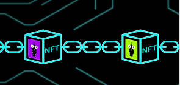

[🔙 Enrere](../) | [🏠 Pàgina principal](http://danimrprofe.github.io/apuntes/)

# Criptomonedes

[Bitcoin](bitcoin.md) és una criptomoneda descentralitzada que utilitza tecnologia blockchain per realitzar i verificar transaccions.

Cada transacció a Bitcoin s'agrupa en un bloc, que és verificat pels nodes de la xarxa mitjançant algorismes de hash.

Els miners són els encarregats de crear els blocs i verificar les transaccions mitjançant la resolució de complexos algorismes matemàtics.

Com a recompensa per la seva feina, els miners reben bitcoins nous, que són generats automàticament cada vegada que es crea un bloc.

Les transaccions a Bitcoin es realitzen a través de [comptes](cuentas.md), que són identificades per adreces úniques a la xarxa.

Per adquirir o intercanviar bitcoins, es poden utilitzar [exchanges](exchange.md), que són plataformes que permeten comprar i vendre criptomonedes amb monedes tradicionals.

Els [wallets o moneders](monederos.md) són aplicacions que permeten emmagatzemar i gestionar criptomonedes, incloent Bitcoin.

Els [NFT](NFT/index.md) o tokens no fungibles són criptomonedes que representen actius digitals únics, com ara obres d'art o col·leccions virtuals.

El [metavers](metaverso/index.md) és un concepte de realitat virtual que es basa en la creació de mons virtuals interconnectats, i que ha estat adoptat per alguns projectes de criptomonedes com Ethereum.

