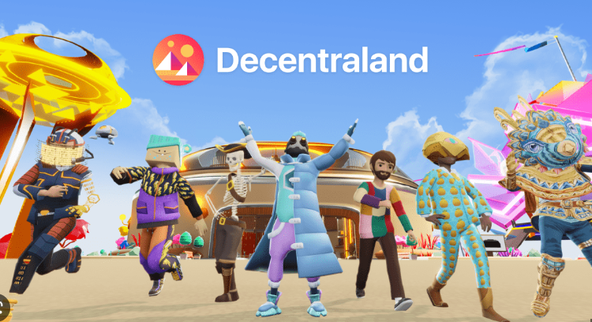
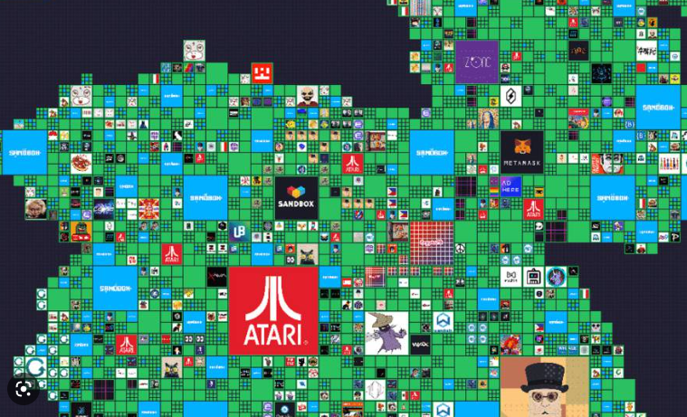

# Metaverso

## ¿Qué es el metaverso?

El metaverso es una **realidad virtual** en la que se combinan la realidad virtual, la inteligencia artificial y la criptomoneda para crear un entorno en el que los usuarios pueden interactuar entre sí y con el entorno. Esta interacción se basa en el intercambio de información, contenido, recursos y servicios a través de la Internet.

Los usuarios pueden crear mundos virtuales, jugar juegos, desarrollar proyectos y aplicaciones, y establecer relaciones con otros usuarios. Los usuarios también pueden comprar y vender productos y servicios, y obtener ganancias de los **activos digitales** en el metaverso.

## Decentraland

Decentraland es una plataforma basada en blockchain que permite a los usuarios crear, experimentar y monetizar contenido y aplicaciones en un mundo virtual 3D. Los usuarios pueden comprar y vender terrenos digitales usando la criptomoneda MANA, construir aplicaciones basadas en la web y subir contenido como gráficos 3D, audio y texto.

La plataforma también permite a los desarrolladores monetizar aplicaciones a través de licencias y publicidad. Decentraland utiliza la tecnología blockchain para ofrecer un entorno sin servidor seguro, manteniendo la propiedad de todos los usuarios y permitiendo un proceso de compra y venta de terrenos digitales sin intermediarios.

## Parcelas

Decentraland organiza las parcelas mediante una cuadrícula de 256m x 256m con coordenadas espaciales. Estas parcelas se organizan en áreas, también conocidos como distritos. Cada distrito se subdivide en regiones, y cada región se subdivide en parcelas. Para navegar por la cuadrícula, los usuarios pueden usar el mapa de Decentraland, que permite explorar las distintas parcelas y ver las ofertas disponibles.

Las parcelas se pueden comprar y vender en la plataforma de Decentraland. Los usuarios pueden comprar parcelas para uso personal, para ponerlas en el mercado o para construir alguna aplicación o contenido de Decentraland. Una vez que una parcela se compra, el dueño es el único responsable del contenido y la administración de la misma.