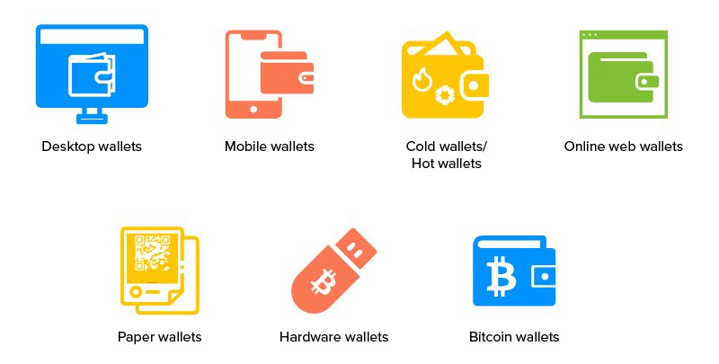
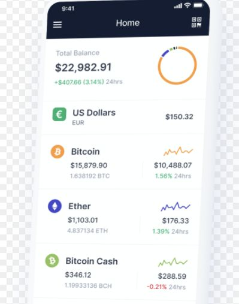

# Monederos (wallets)

Para almacenar bitcoin, necesitamos una dirección, y asociada a alle unas **claves**. Estas claves, se guardan en un **monedero digital**, también llamado **wallet**.

El monedero se guarda en un programa, app o web Se accede a él con una cuenta de usuario. También puede puede guardarse en smartphone, PC o USB.

!!  warning

    Es importante recordar que nosotros no guardamos dinero, que se guarda en forma de apuntes en la blockchain, sino que guardamos las claves que nos permiten acceder a nuestra cuenta y operar con ella.

https://bitcoin.org/es/elige-tu-monedero?step=1

Es importante recordar que en ningún momento se asocia esta cuenta con unos datos reales, salvo la información que tengamos que dar en caso de contratar los servicios de un **exchange**.

Si se pierden las claves, se pierde el acceso a la cuenta y, por tanto, el acceso al dinero.

Del mismo modo que podemos tener varias monedas distintas en una cartera
Podemos tener claves de varias criptomonedas en un misma billetera.

## Bitcoin wallet

1. Monederos de escritorio: Los monederos de escritorio se instalan en una computadora portátil o de escritorio y le dan al usuario el control completo del monedero. Solo son accesibles desde la computadora individual en la que se descargan. Los monederos de escritorio ofrecen uno de los niveles de seguridad más altos, pero si su computadora es pirateada o obtiene un virus, es posible que pierda todos sus fondos.

2. Monederos en línea: Los monederos en línea son sitios web o aplicaciones que le permiten usar su servicio para almacenar sus monedas. Si bien son más convenientes de usar, se almacenan de forma remota y, por lo tanto, la seguridad no está completamente en sus manos.

3. Monederos móviles: Los monederos móviles son aplicaciones que puedes descargar en tu teléfono. Los monederos móviles te permiten llevar tus monedas a donde quiera que vayas y también te permiten gastar tus monedas en tiendas y establecimientos reales.

4. Monederos de hardware: Los monederos de hardware son dispositivos físicos que parecen unidades USB. Almacenan tus monedas sin conexión y lejos de amenazas potenciales y también te permiten gastar tus monedas en tiendas y establecimientos reales.

