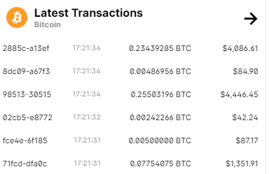
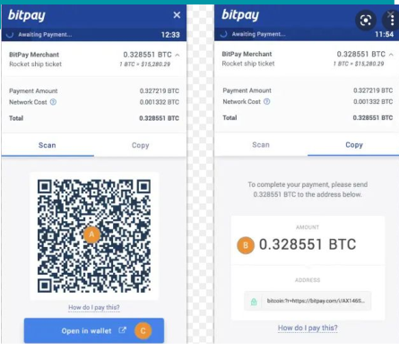

# Transacciones
Cómo se intercambian criptomonedas

## Transacciones

- Cada cuenta tiene una dirección pública
- La cuenta no se asocia a una persona públicamente.
- Las transacciones son movimientos de dinero entre varias cuentas.
- El dinero se mueve de una cuenta a otra mediante transacciones
- Las transacciones son públicas, y cualquiera puede verlas

- Deben ser confirmadas para que tengan efecto.
- Parte del dinero pagado se descuenta para luego repartirse como recompensa (como una comisión)

## Validación de transacciones

- Cada vez que alguien quiere enviar bitcoin a otra cuenta, la transacción es validada por la red:
- Asegurarse de que la persona tenga los bitcoins para transferir
- Si la persona tiene los bitcoins, se agregan al libro
- Para asegurar el libro mayor, los mineros lo sellan detrás de un código computacional
- No puede haber doble gasto ni falsificación.

## ¿Cómo traspasar dinero?

- Cualquiera puede enviar a una dirección pública
- El método más fácil es crear un QR, que incluye la dirección y la cantidad
- Los pagos son irreversibles
- Los pagos tardan un tiempo en hacerse efectivos
- Se paga una comisión a cambio

