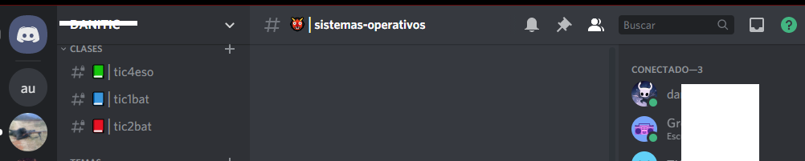

# Discord

---

## Introducción

El funcionamiento de``Twitch`` va muy ligado a Discord, una herramienta de chat y voz para comunidades virtual.

Sirve de herramienta de comunicación entre los seguidores de un determinado canal, fundamentalmente cuando este no está emitiendo. De este modo comparten dudas, archivos, y hablan entre ellos.

---

## 쯈ué es Discord?

Discord es una plataforma gratuita de chat de texto y voz para comunidades, disponible en todos los sistemas operativos.

---

Puede ser usado desde:

* Navegador: Discord navegador https://discord.com/
* Smartphone: Discord play store https://play.google.com/store/apps/details?id=com.discord&hl=es_419&gl=US
* Aplicación de Windows: Discord para Windows

Otras opciones de videoconferencia requerían compartir direcciones IP para conectarse, o se trataban de servicios pesados como Skype o Teamspeak.

---

## Servidores

Cada comunidad de personas puede crear su propio servidor de Discord, al que nos podemos conectar si nos invitan previamente. De este modo, podemos conectarnos a tantos servidores como queramos, y cambiar de uno a otro.

Podemos buscar servidores públicos en algunas páginas como Discord Servers

---

## Crear un servidor

Discord se organiza por **servidores**. Cada comunidad de usuarios alrededor de un tema concreto se conecta a un servidor (que alguien ha creado y administra) para comunicarse.

El proceso de creación es sencillo, y existen **plantillas** predefinidas, por lo que parte de nuestro servidor vendrá creado por defecto.

---

---

## Canales

Cada servidor tiene varios canales de texto y voz, donde los usuarios pueden interactuar entre ellos. Cada canal trata de un tema concreto.

Los usuarios van al canal de la temática que más les interesa o la que tiene relación con su duda o consulta.

Los nombres de los canales comienzan con # como ``#musica`` o ``#juegos``.

---

## Canales de voz

Funcionan como una videollamada continua a la que se pueden unir en cualquier momento. De este modo, también podría compartir la pantalla y dar clase a distancia, así como comunicarme con ellos por voz.

---

## Roles

Los ``roles`` funcionan como en la vida real. En principio todas las personas somos «iguales ante la ley», pero cada una tiene un rol en una empresa, instituto o en la sociedad.

Todos los usuarios que tienen asignados el mismo rol, tienen unos ``permisos`` y pueden hacer más cosas que las personas que no lo tienen.

---

## Bots

Podemos crear usuarios Bot, que responderán automáticamente a ciertos comandos que escribamos en el chat.

- Buscar bots de Discord: https://top.gg/
- Uno de los bots más conocidos es este: https://mee6.xyz/

Los bots responden a ciertos ``comandos``, que nos permiten interactuar con ellos.

Suelen comenzar por un carácter especial, como por ejemplo  ``!``

