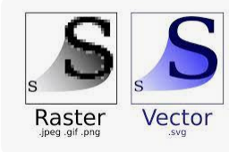

[🔙 Enrere](../) | [🏠 Pàgina principal](http://danimrprofe.github.io/apuntes/)

# Imágenes vectoriales

Las imágenes vectoriales son un tipo de gráfico que utiliza vectores para representar imágenes y gráficos. Estos vectores se componen de líneas y formas geométricas (como círculos, rectángulos, etc.) para crear imágenes.

Estas imágenes no se ven afectadas por la resolución o el tamaño de la pantalla, lo que las hace ideales para la impresión, el diseño web y otras aplicaciones de gráficos. Las imágenes vectoriales se pueden escalar sin perder calidad, lo que las hace versátiles.

Además, estas imágenes son fáciles de editar y modificar, lo que les permite a los diseñadores crear contenido único para sus proyectos.