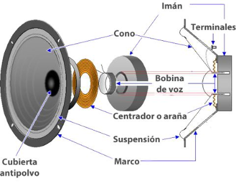

# 3. Generación de sonido

Para generar un sonido necesitamos hacer vibrar el aire de alguna forma (palmas, cuerdas vocales, etc.). Algunos aparatos e instrumentos musicales generan sonido utilizando unas membranas que se mueven en función de la frecuencia del sonido. Otros modifican el aire de alguna forma para producir sonido.

## 3.1. Sonido en altavoces

Los altavoces, según la electricidad que reciben, activan un electroimán. Este electroimán mueve la membrana, que al desplazarse mueve a su vez el aire creando sonido.

Podéis ver un vídeo del proceso a cámara lenta. Se ha filmado a cámara lenta, porque normalmente la vibración de la membrana es tan rápida que no podemos percibirlo.

En los sonidos graves (generalmente en los subwoofers), la vibración es más lenta y por tanto fácil de ver.

