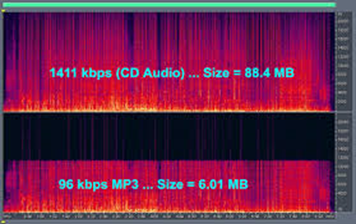

# 6. FORMATO DE AUDIO DIGITAL

Una vez convertido el audio en sonido digital (ceros y unos), lo podemos guardar de diferentes formas. El formato del archivo indica la estructura con la que el sonido es almacenado.

La **extensión** del archivo (mp3, wav, flac) nos indica el tipo de archivo del que se trata. Cada formato tiene unas ventajas y unos inconvenientes concretos. Además, ayuda al sistema operativo a saber que es un archivo de audio y decidir con qué programa se va a abrir.

## COMPRESIÓN

Si los guardamos tal cual, los archivos de audio contienen toda la información del sonido original. De esta forma, tenemos archivos de mejor calidad, pero mayor tamaño.

Gracias a los ordenadores podemos comprimir los archivos de sonido y vídeo utilizando operaciones matemáticas para reducir el tamaño descartando parte de la información que no somos capaces de apreciar.

La calidad del sonido es menor pero también disminuye el tamaño. Una canción comprimida en MP3 puede ocupar **una décima parte** de lo que ocuparía la misma canción sin comprimir

La invención del archivo MP3 permitió que la música ocupara menos en los ordenadores. Gracias a ello se popularizaron los reproductores MP3, que permitían almacenar cientos de canciones, mientras que un CD normal daba para unas 15 aproximadamente.

Al ocupar menos los archivos también se popularizó la piratería musical a través de internet, a través de diferentes programas de intercambio de archivos, como Napster, Ares, o eMule, por ejemplo.

