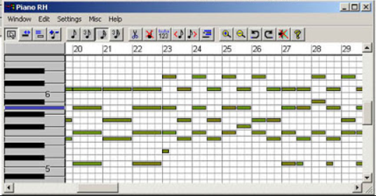
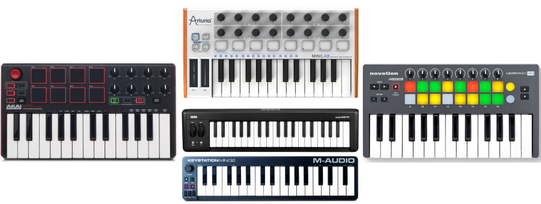
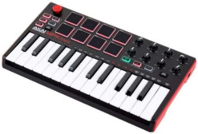

# 7. Midi

El format **MIDI** (acrònim de Musical Instrument Digital Interface) és un protocol de comunicació que permet als dispositius electrònics musicals, com ara sintetitzadors, teclats, controladors MIDI i ordinadors, comunicar-se entre si i controlar i reproduir sons i música de manera digital.

A diferència dels formats d'àudio, el MIDI no guarda una descripció sonora real del so, sinó que registra una sèrie d'instruccions i esdeveniments musicals com a notes, acords, canvis de tempo, expressions d'interpretació i altres dades de control de paràmetres que es envien als **dispositius MIDI** per generar el so final.

Gracias a esta tecnología, entre otras cosas, podemos **emular** (simular de forma artificial), utilizando teclados midi, el sonido de cualquier instrumento, desde una batería hasta una guitarra, etc. Con solo una herramienta, podemos crear una canción musical completa.

## Teclados midi

Un teclado MIDI es un dispositivo de entrada que se conecta a un sistema de audio digital para controlar los parámetros de sonido. Estos parámetros incluyen el tono, la velocidad, el volumen, los efectos y otros parámetros.

Los teclados MIDI se usan para crear música, componer canciones, grabar pistas y realizar demostraciones de audio. Estos teclados se conectan a un ordenador, una consola de producción de audio digital, una unidad de control de sonido y otros dispositivos.

Se pueden programar para generar una amplia variedad de sonidos digitales, desde los sonidos clásicos de la música clásica hasta el sonido contemporáneo de la música moderna.

Ejemplos:

- https://www.youtube.com/watch?v=C_C0rAKiBEA
- https://www.youtube.com/watch?v=WaHMwMruD80
