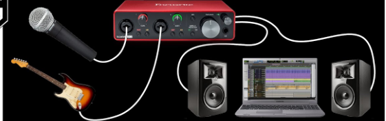

# Interfícies d'audio

Les interfícies dàudio són dispositius que permeten connectar instruments, micròfons i altres equips dàudio a un ordinador per gravar, editar i reproduir música en un entorn digital. Aquestes interfícies actuen com a intermediaris entre els dispositius dàudio i el programari de gravació o producció musical.

## Tipus

Hi ha una gran varietat dinterfícies dàudio en el mercat, que varien en termes de nombre d'**entradas** i **sortides**, qualitat de so, connectivitat i altres factors.

Les interfícies més senzilles poden tenir només un parell d'entrades per a micròfon o guitarra, mentre que les interfícies més complexes poden tenir diverses entrades i sortides, amb preamplificadors d'alta qualitat i convertidors d'àudio de gamma alta.

Algunes interfícies dàudio també vénen amb **efectes** integrats, com **equalitzadors** i compressors, i ofereixen opcions de **monitorització** per escoltar la gravació en temps real.

Les interfícies dàudio són una eina essencial per a la producció musical i la gravació a l'entorn digital. Permet als músics i productors gravar i editar àudio d'alta qualitat en els seus estudis, i també són utilitzades en estudis d'enregistrament professionals per produir música d'alta qualitat.