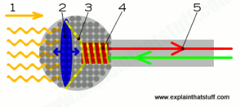

# MICRÓFONOS

Los micrófonos contienen una membrana que vibra cuando le llega aire.  En función de la fuerza del aire y la frecuencia, fibra de una forma u otra. Esta vibración se convierte en una señal eléctrica que se envía a un equipo de sonido para ser amplificada o guardada de algún modo.

Existen multitud de tipos de micrófonos, según su construcción y su uso. En este caso, podéis ver dos modelos de micrófono habituales.

## Filtres

Els filtres, com els antipop o anti vent, també són molt útils per millorar la qualitat de les gravacions. L'**antipop** ajuda a reduir els sons de "popping" que es produeixen quan es pronuncien certes lletres, com la "p" o la "b", mentre que **l'anti vent** redueix el soroll del vent en exteriors.

