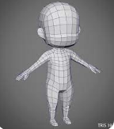

# 1. Modelado

El modelado en diseño 3D es el proceso de creación de una representación tridimensional de un objeto a través de la manipulación de modelos en un software de diseño 3D. Esta técnica se utiliza para crear objetos tridimensionales que se pueden manipular y animar.

## Objetos iniciales

- El proyecto nuevo siempre incluye un objeto **cubo**.
- El cursor 3D (que veremos más adelante) en medio
- A la izquierda la **cámara principal**
- A la derecha la **luz** que viene por defecto.

## Cambiar el cursor

- Seleccionando un objeto y pulsando Mayúsculas + S
- Seleccionando **Cursor to selected** o pulsando la tecla 2, luego vuelve añadir una figura y aparecerá en el centro del cursor

## Crear línea entre 2 vértices

Si quisieras crear una nueva línea entre 2 vértices, lo puedes hacer seleccionando los vértices que quieras y pulsando J para crear una nueva arista.

Creando una nueva arista desde 2 vértices y dando lugar a 2 caras.
