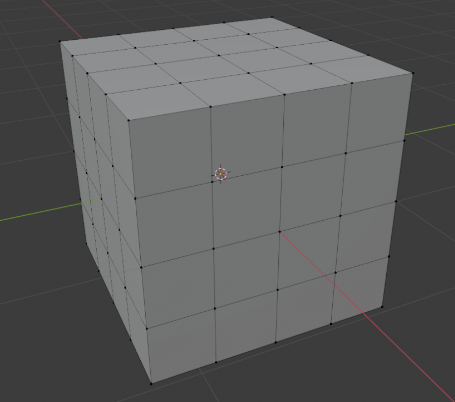
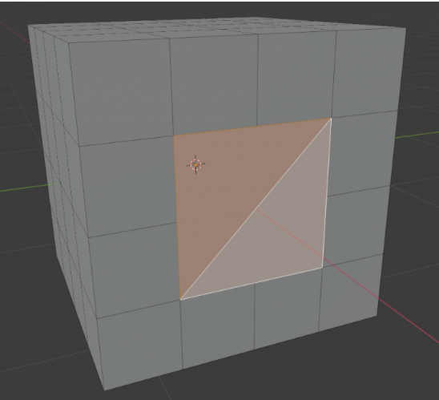

# Subdividir

Otra opción de gran utilidad puede ser subdividir las caras de un objeto, para ello limpia la escena y crea un cubo, luego entra en modo edición con Tab.

Después activa el modo selección de cara con 3 selecciona todo con L estando encima del objeto, y pulsando Clic derecho sobre subdividir. Hazlo un par de veces para que te siga comentando algunos consejos. Debe quedar algo así.

Para seleccionar varias caras, como ya hemos visto, puedes pulsar sobre una de ellas y luego con Mayúsculas ir seleccionando el resto, pero si quieres seleccionar una fila completa, puedes pulsar sobre una cara y con Control pulsando en la final te seleccionaría todo.

Ahora vamos a ver otra cosa, quita la selección y selecciona solo las 4 caras del medio de la vista frontal, luego con X selecciona Borrar caras para eliminar esas 4 caras y poder ver el interior del cubo.

Ahora una forma fácil de rellenar esa cara es entrando en modo arista con 2 y luego pulsando Alt + CI sobre uno de los vértices del agujero creado, de esta forma te seleccionará automáticamente todos los vértices que estén unidos alrededor del agujero. Luego pulsando F, directamente te rellenará el espacio vacío entre la selección con una nueva cara.

Si quisieras crear una nueva línea entre 2 vértices, lo puedes hacer seleccionando los vértices que quieras y pulsando J para crear una nueva arista.

