- [``Blender``](#blender)
- [1. Modelado](#1-modelado)
  - [Taza](#taza)
  - [Monigote](#monigote)
- [2. Entornos HDRI](#2-entornos-hdri)
  - [Agregando el HDRI](#agregando-el-hdri)
- [3. Animación](#3-animación)
  - [3.1 Cámara en trayecto](#31-cámara-en-trayecto)
  - [3.2 Cámara a vista](#32-cámara-a-vista)
- [3.1 Animación personalizada de cámara](#31-animación-personalizada-de-cámara)
  - [Crear una cámara](#crear-una-cámara)
  - [Ver el punto de vista de la cámara](#ver-el-punto-de-vista-de-la-cámara)
  - [Modificar la posición](#modificar-la-posición)
  - [Mover la cámara con nosotros](#mover-la-cámara-con-nosotros)
  - [Configuración de la cámara](#configuración-de-la-cámara)
  - [Insertar fotogramas clave](#insertar-fotogramas-clave)
- [3.2 Animación de un objeto](#32-animación-de-un-objeto)
  - [Enfoque y desenfoque](#enfoque-y-desenfoque)
  - [Renderizar la animación](#renderizar-la-animación)
  - [Hacer que la cámara siga una curva y apunte a objeto](#hacer-que-la-cámara-siga-una-curva-y-apunte-a-objeto)
- [4. Texturas](#4-texturas)
- [5. Armadura](#5-armadura)
  - [Inicio](#inicio)
  - [Crear un hueso](#crear-un-hueso)
  - [Columna vertebral](#columna-vertebral)
  - [Cadera](#cadera)
  - [Pierna](#pierna)
  - [Terminar](#terminar)
  - [Mover todo el personaje](#mover-todo-el-personaje)
  - [Animación](#animación)
- [6. Renderizado](#6-renderizado)
- [Renderizado](#renderizado)
  - [Motor de renderizado](#motor-de-renderizado)
  - [Eligiendo el motor de renderizado](#eligiendo-el-motor-de-renderizado)
  - [Parámetros de renderizado](#parámetros-de-renderizado)
  - [Renderizar animación](#renderizar-animación)
- [7. Sistemas de partículas](#7-sistemas-de-partículas)
- [Sistemas de partículas](#sistemas-de-partículas)
  - [Partículas](#partículas)
  - [1. Crear el objeto que va a caer como si fuera un copo](#1-crear-el-objeto-que-va-a-caer-como-si-fuera-un-copo)
  - [2. Crear un plano con emisiones](#2-crear-un-plano-con-emisiones)
  - [3. Configuramos el plano para que emita partículas](#3-configuramos-el-plano-para-que-emita-partículas)
  - [4. Cambiamos el tipo de emisión para emitir objetos](#4-cambiamos-el-tipo-de-emisión-para-emitir-objetos)
  - [Colisiones y amortiguación](#colisiones-y-amortiguación)
  - [6. Iluminación](#6-iluminación)
  - [Insertar luz de área](#insertar-luz-de-área)
  - [Potencia](#potencia)
  - [Altura de la luz](#altura-de-la-luz)
  - [Cámara](#cámara)
  - [Escena final](#escena-final)
- [8. Crear telón de fondo](#8-crear-telón-de-fondo)
  - [Paso 1: Crear telón](#paso-1-crear-telón)
  - [Paso 2: Crear la luz](#paso-2-crear-la-luz)

# ``Blender``


``Blender`` es un software de creación 3D gratuito y de código abierto. Está diseñado para modelado, animación, simulación, renderizado, composición y creación de gráficos interactivos. Se trata de una herramienta completa para la creación de contenido 3D con todo lo que necesita para crear proyectos profesionales.

``Blender`` se puede utilizar para la creación de aplicaciones, juegos, películas, producciones de televisión y mucho más.

# 1. Modelado

El modelado 3D es el proceso de crear representaciones tridimensionales de objetos o escenarios mediante software especializado, utilizando diferentes técnicas

## Taza

https://www.youtube.com/watch?v=kPHf9DlkGro

## Monigote


https://www.youtube.com/watch?v=AW8hmeC5x2c

# 2. Entornos HDRI

En Blender, puedes cargar un HDRI como mapa de fondo para influir en la iluminación global de tu escena, o usarlo como fuente de luz ambiental para mejorar la calidad visual en tus renderizaciones. Los HDRI en Blender son especialmente útiles para lograr reflexiones y sombras más naturales alrededor de tus objetos

Entornos con HDRIs
Los HDRIs son básicamente imágenes 360° raw de alto rango dinámico que nos sirven para iluminar.
Nosotros podemos iluminar nuestra escena poniendo por ejemplo una luz de punto que aquí le podemos cambiar la fuerza le podemos cambiar también el color.
Lo que vamos a usar son los HDRi y resulta que son del mismo creador de poly haven. Se trata de una página web en la que podemos encontrar múltiples recursos para nuestros renders, como por ejemplo texturas, entornos, etc.


Entrando a la página veremos que tenemos un montón de HDRi que podemos usar totalmente de forma gratuita en nuestros renders.

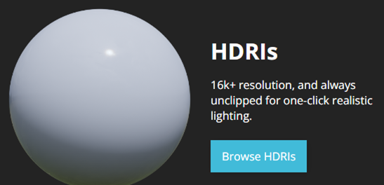

A continuación veremos varios de estos entornos, así como una panorámica de cómo se verían.


Vamos a elegir uno que nos interese. Nos vamos aquí abajo la descargamos como 2k.  Según la resolución que elijamos, más detallada se verá la escena, aunque el archivo descargado ocupará más tamaño.


Ahora en descargas tendremos el archivo, con extensión exr. Este archivo se guardará en la carpeta descargas de nuestro perfil.


Ahora lo que vamos a hacer es seleccionar esta bola del mundo que todavía no habíamos visto y nos permitirá visualizar el entorno.


## Agregando el HDRI

Le damos a environment texture

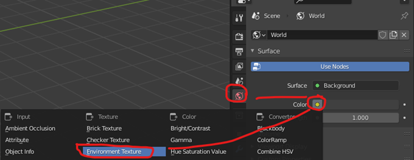

Le damos a open y seleccionamos HDRI que acabamos de descargar que es este de aquí le damos a abrir


Buscamos el archivo exr y lo abrimos.


Veremos que ahora nuestro objeto está dentro de un entorno que lo ilumina como si estuviera ahí.


Si yo por ejemplo ahora añadiese una esfera y la aplicó a esta esfera un material súper metálico básicamente la llevo el metallic al máximo y el roughness se lo bajo


Si hacemos CBD y shade smooth se vería como una esfera perfecta y ahí veis todo lo que está reflejando. Ahora la esfera estaría reflejando perfectamente este entorno veis que se ve como una bola de disco porque se ven todas sus caras por separado.


Esta sería una forma hiperrealista de iluminar nuestra escena

# 3. Animación

## 3.1 Cámara en trayecto

Los pasos seguidos son:

- Crear una curva
- Agregar restricción a la cámara para que siga trayecto
- Restablecer posición de la cámara
- Agregar restricción a la cámara para que apunte a objeto
- Modificar el trayecto de la curva (en edit mode)

Video: https://www.youtube.com/watch?v=M9XMEEMnRJk


## 3.2 Cámara a vista

# 3.1 Animación personalizada de cámara

Vamos a hacer que la cámara se mueva alrededor de la escena, mientras que el objeto permanecerá fijo. En este caso, nosotros indicaremos todos los movimientos que va a seguir la cámara.

```
En resumen, lo que haremos será tomar "fotos" de la escena desde diferentes ángulos
en momentos determinados, y ``Blender`` calculará los movimientos a realizar entre los dos puntos.
```

## Crear una cámara

Si necesitamos crear una cámara, para ello hacemos <kbd>shift + a</kbd> y elegimos crear cámara.

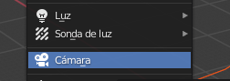

Por defecto la cármara nueva ``Blender`` la colocará en el centro de la escena. Si tenemos algún objeto ahí puede ser que no veáis la cámara porque este lo esté tapando.

## Ver el punto de vista de la cámara

Podemos darle al 0 para irnos a la vista desde la cámara. También podemos seleccionar el icono de cámara arriba a la derecha.


Como veis si intentamos movernos nos salimos de la cámara. También podemos pulsar 0 para salir de la vista.

## Modificar la posición

La cámara la podemos mover como cualquier objeto, por ejemplo haciendo <kbd>g x</kbd> o <kbd>g z</kbd> para moverla en estos ejes.

También podemos colocarla con la tecla <kbd>n</kbd> y variando los parámetros de posición y rotación a mano. Tal como loe hemos hecho, hemos distanciado la cámara 10 metros en el eje y, y la rotación de 90 grados respecto al eje X.


A continuación podéis ver como queda la escena con estos parámetros. Recordad que cada cuadrado mide 1m por lado en ``Blender``, por lo que os podéis hacer una idea de las distancias.


## Mover la cámara con nosotros

En ocasiones es más fácil animar la cámara si hacemos que nos siga a nosotros. Para ello, con la cámara seleccionada y la tecla <kbd>n</kbd> , a continuación seleccionamos view y lo que es camera to view. Ahora cuándo movamos la vista también se mueve nuestra cámara, que nos seguirá.


## Configuración de la cámara

En la configuración de cámara le damos poner que queremos una distancia focal de 120 milímetros (mm)

Vamos a componer nuestra imagen de esta forma vale la animación que quiero que haga la cámara es muy simple simplemente quiero que haga una especie de órbita.


## Insertar fotogramas clave

Los frames son las fotos que componen un video.

- Cuantos más frames en un segundo, más fluida se verá la animacion.
- Si tenemos un framerate de 30 fps y grabamos 120 fps, nuestra animación durará 4 segundos.

**¿Qué es un fotograma clave o keyframe?**

Un keyframe es en realidad una marca que guarda la posición, escala, rotación y opacidad de un objeto en un momento específico de la escena. Si creas más de dos keyframes con una variación de posición, escala, rotación y opacidad entre ellos, verás que automáticamente ocurrirá una animación

Si le damos al 0 nos ponemos en la vista la cámara, y veremos que si nos movemos, la cámara nos sigue.


Lo que vamos a hacer para ello va a ser un aquí al primer fotograma le vamos a dar con nuestra cámara seleccionada aquí le damos a la i y esto nos va a insertar un keyframe un fotograma clave le vamos a localización y rotación

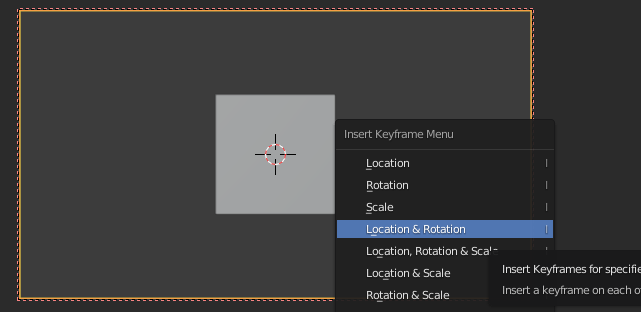

Vamos a avanzar 100 fotograma movemos un poquito la cámara e insertamos otro fotograma localización y rotación


 Si ahora le damos al play ya tendríamos nuestra animación hecha. Veréis que la animación no se detiene en el 100, por lo que la tendremos que parar nosotros.

Analicemos el timeline

Aquí vemos que el único objeto animado ha sido la cámara. De hecho, el cubo sigue en su sitio.


Si ampliamos podemos ver la siguiente información. Tenemos dos **keyframes**

- Uno en el 0. Es la "foto" de nuestra escena en ese momento.
- Otro en el 100. Aquí las posiciones de los objetos habrán cambiado.

En medio, ``Blender`` calculará (extrapolará) todos los frames intermedios que conducirán al movimiento entre esas dos posiciones.


# 3.2 Animación de un objeto

Ahora vamos a hacer que el cubo se haga más pequeño poco a poco. Para ello, en primer lugar, debemos seleccionar el cubo.


Veremos que el timeline en la parte inferior está vacío, pues no lo hemos animado todavía el cubo (solo habíamos animado la cámara).

El primer keyframe lo ponemos en el 100. En este caso, repetiremos los mismos pasos, pero ahora seleccionamos Posición, rotación y escala.

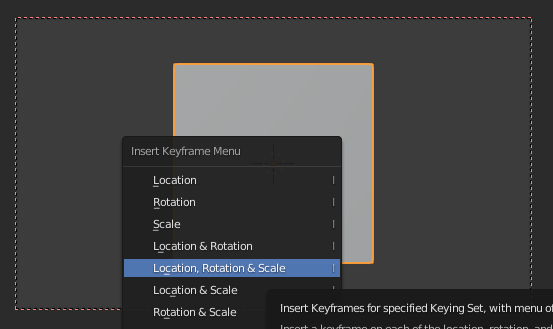

Luego nos posicionamos en el 160, escalamos el cubo y fijamos el segundo keyframe


Al tener 160 frames:

- En un video de 24 FPS nuestra animación durará: 160 / 24 = 6,67 s
- Si fuera de 60 FPS, duraría 2,6 s

Si seleccionamos tanto la cámara como el cubo, veremos en el timeline ambos objetos, y sus correspondientes keyframes.


## Enfoque y desenfoque

Lo que vamos a hacer es que nuestra cámara enfoque y desenfoque. Para ello nos vamos a donde pone cámara y donde pone de **perfil de profundidad de campo** y como veis automáticamente se ha desenfocado todo.


Podemos decirle que enfoque un objeto en concreto, por ejemplo nuestro cubo. Hará un autofocus hacia el objeto, esté donde esté.


## Renderizar la animación

Ya lo tenemos casi todo preparado para irnos a renderizar, pero primero tengo que ajustar como queremos renderizar esta imagen.

## Hacer que la cámara siga una curva y apunte a objeto

Los pasos seguidos son:

- Crear una curva
- Agregar restricción a la cámara para que siga trayecto
- Restablecer posición de la cámara
- Agregar restricción a la cámara para que apunte a objeto
- Modificar el trayecto de la curva (en edit mode)

Video: https://www.youtube.com/watch?v=M9XMEEMnRJk


# 4. Texturas

En este video Diseñamos un vaso o taza en ``Blender`` y le aplicamos imágenes en la superficie de un objeto mediante el uso de materiales.

Las imágenes están descargadas de Internet y editadas en Inkscape. Recordad buscar imágenes con transparencias, preferiblemente png.

https://studio.youtube.com/video/P_f4C_0ohw4/edit

# 5. Armadura

## Inicio

Para animar nuestro personaje tendremos que dotarle, además del modelo, de un esqueleto. Al mover los huesos de este esqueleto, el modelo se moverá acorde a ellos.

## Crear un hueso

Con **shift**+a vamos a abrir el menú y vamos a crear el primer hueso en modo objeto.


El hueso ahora no lo veremos porque está dentro de mi figura. Vamos a activar esta opción para que se vea siempre por delante del personaje, aunque no lo está realmente.


Desde la vista frontal con el hueso seleccionado y la **tecla s** lo vamos a escalar hasta que tenga el tamaño del cuerpo

## Columna vertebral

Ahora para editar el hueso hay que entrar en el **edit mode**. Lo que quiero es hacer lo que sería la columna vertebral así que vamos a seleccionar el hueso y **clic derecho** le vamos a dar a subdivide por defecto sólo se subdivide una vez.

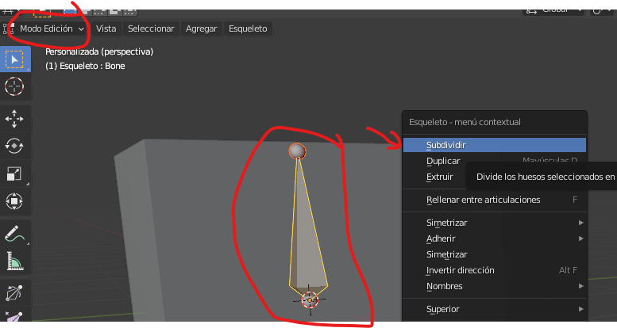

Aquí abajo podemos cambiar el número de subdivisiones en total le vamos a dejar tres huesos para el cuerpo. O sea, le metemos dos subdivisiones desde la vista frontal pulsando 1 del teclado numérico


## Cadera

Vamos a seleccionar el circulito debajo del hueso y le vamos a dar a la para escribir el hueso y sacarlo que sería la cadera con la **tecla G** lo movemos y con R lo rotamos yo lo coloca donde más o menos iría la cadera para que luego todo funciona lo mejor posible.

## Pierna

De esa cadera vamos a sacar la pierna igual que antes seleccionamos el circulito y con la **tecla E** extremos para que tenga rodilla necesitamos otro hueso más así que como ante CBD encima del hueso y los dividimos una vez desde la vista lateral pulsando la **tecla 3** del teclado numérico de coloco los huesos siguiendo un poco mejor la forma del personaje hacer con la tecla G o las flechitas.

Vamos a duplicar los huesos del lado izquierdo, pero para que funcione correctamente se tienen que renombrar en este caso nos sirve esta opción automática 11seleccionamos el hueso pulsamos CBD encima y dentro de names pulsamos en auto name let bright

Se hace lo mismo con los tres huesos y hecho esto lo seleccionamos pulsamos CBD encima y le damos a la opción de simetría y ahí lo tenemos le toca un poco el hueso de la columna que creo que está un poco bajo y ya nos queda duplicar el hueso de arriba con sic depara el cristal y duplicar el hueso del medio para poder mover la mochila también esto no tiene que ver con eltuto pero lo voy a poner rápidamente al otro lado por si me está molestando con los cuadrados que salen ahí a veces

## Terminar

ya tenemos todos los huesos necesarios así que vamos a salir del **edit mode** con ++tab++ al offset mount y lo que hacemos es seleccionar todas las partes del personaje primero manteniendo la tecla ++shift++ pulsada y por último seleccionamos los huesos.

A continuación, pulsamos ++ctrl+++P y elegimos esta opción para unir los huesos al personaje de forma automática para comprobar que no ha funcionado seleccionamos los huesos en esta esquina le damos a la opción pose mode donde podemos mover los huesos para apoyar a nuestro personaje.

Comprobamos que todo funciona[Música]y ahora vamos a mejorar un par de cosas para que nuestro rey funciones aún mejor

Cambiamos del modo pose al **edit mode** seleccionamos el hueso de la mochila y luego el de la espalda. El orden es importante una vez seleccionado pulsamos ++ctrl+++P y le damos aquí offset así cuando movamos ese huevo ese huevo ese huevo y así cuando movamos ese hueso la mochila lo seguirá y con el cristal podemos hacer lo mismo.

Primero seleccionamos el hueso del cristal y luego el hueso de la cabeza lo ponemos todo un poco para asegurarnos de que funcione bien y para volver atrás pulso ++ctrl+++z obviamente todos los ríos tienen un límite y si hacéis los movimientos muy extremos se os va a romper, pero la verdad que me ha quedado bastante bien y creo que soporta posturas extremas ya podemos mover todas las partes del personaje

## Mover todo el personaje

Necesitamos un último hueso que nos permita moverlo todo a la vez así que volvemos a **edit mode** con la parte de abajo del hueso seleccionada pulsamos la E para extruir un nuevo hueso y lo colocamos por aquí.

Ahora lo tenemos que conectar así que primero seleccionamos el hueso de la columna y luego el del suelo pulsamos ++ctrl+++P y le damos a keep offset. Como veis ya está conectado así que ahora hacemos lo mismo con los huesos de la cadera recordad desde el **edit mode** primero seleccionamos el hueso de la cadera y después el del suelo pulsamos ++ctrl+++P y tipo offset desde el pose mode comprobamos que funciona volvemos **edit mode** y hacemos exactamente lo mismo con el hueso de la otra cadera y ya tenemos nuestro gris completo listo para ser animado.

## Animación

Ahora os voy a enseñar una pequeña introducción de cómo funciona la línea de tiempo y cómo crear fotogramas clave antes de enseñar cómo animar al personaje corriendo

Voy aponer un ejemplo con el hueso que mueve todo el personaje con este seleccionado situado en el fotograma 1 vamos a pulsar la I y le damos a la opción location rotation and scale para crear un fotograma.

Como veis se no crea este puntito amarillo es una clave que nos guarda la posición la rotación y la escala actual del hueso que tenemos seleccionado y ahora si nos vamos al fotograma 80 por ejemplo desplazamos el personaje y le creamos otro aquí como antes estaremos guardando esa posición y

Si le damos al **play** vemos cómo el personaje va de una a otra esto funciona igual con todos voy a crear un aquí con todos los huesos seleccionados para que me guarde la pose completa del personaje quieto en el fotograma 1 y en el timeline vamos creando keys por cada movimiento que hacemos.

# 6. Renderizado

# Renderizado

Renderizar es el proceso mediante el cual se crea un archivo de imagen o película definitivo a partir del diseño que estamos realizando.

El proceso de renderización es importante porque nos permite visualizar el resultado final de nuestro trabajo y asegurarnos de que se vea exactamente como lo queremos. También nos permite generar un archivo de imagen o película que se puede compartir con otros o utilizar para otros fines.

Antes de renderizar es importante elegir los parámetros necesarios como:

- El motor de renderizado
- La resolución y tasa de frames de renderizado
- El lugar en el que se guardará el archivo de video final.

## Motor de renderizado

El renderizado 3D es un proceso computarizado y, por lo tanto, requiere de una gran cantidad de **recursos**. Es importante tener en cuenta esto al seleccionar el software de renderizado adecuado, ya que algunos programas son más exigentes en cuanto a los recursos necesarios que otros.

En general, el renderizado 3D es un proceso largo y complejo. Sin embargo, existen algunas formas de acelerar el proceso de renderizado, como la utilización de un PC con una tarjeta gráfica potente o el uso de un servidor de renderizado en la nube.

## Eligiendo el motor de renderizado

Para renderizar estamos usando el motor de renderizado **eevee** que es el más rápido, aunque también tendríamos el **cicles** que éste es más realista pero también lleva mucho más tiempo de renderizado


## Parámetros de renderizado

Lo que vamos a hacer va a ser irnos a este segundo icono aquí tenemos el tamaño, los fotogramas, fotogramas por segundo, cuánto queremos que dure.

Vamos a configurar los siguientes parámetros

- Resolución FullHD
- Frame inicio y finalización
- Ubicación del archivo guardado
- Formato
- Contenedor
- Códec de video
- Calidad


## Renderizar animación

Por último, vamos a renderizar el vídeo. Aquí es cuando tendremos que esperar más o menos tiempo, en función de la duración del vídeo, calidad y la tasa de frames, entre otros factores.


# 7. Sistemas de partículas

# Sistemas de partículas

Un sistema de partículas es un conjunto de partículas que se mueven de forma coordinada. En ``Blender``, un sistema de partículas se puede usar para crear efectos como humo, nieve, lluvia, etc.

Los sistemas de partículas en ``Blender`` se pueden configurar de forma muy detallada, permitiendo a los usuarios controlar cosas como la velocidad, el tamaño y la forma de las partículas.


## Partículas

Crearemos un árbol de navidad y crearemos un efecto de nieve para practicar los sistemas de partículas.


La simulación con sistemas de partículas permite obtener animaciones complejas de objetos que responden a fuerzas gravitatorias y acciones como las que produce el viento o un campo magnético. De esta forma podemos recrear lluvia, nieve, y otros.

Vista lateral del resultado


## 1. Crear el objeto que va a caer como si fuera un copo

El copo que vamos a crear es una icosfera y, a partir de ella se crearán múltiples copias.


Colocamos una icosfera con++shift++a mesh

Con G nos la colocamos en un sitio que no vea la cámara,  fuera de plano. Esto que véis es desde  shading


Le damos material y color para que se vea. Vamos a crear un material nuevo y le vamos a cambiar el nombre a nieve.


Le damos las características que queramos, que hagan que los copos se vean lo más similares posibles a la nieve real.

Metálico y especular son ambos tipos de materiales que se pueden usar en ``Blender``. Los materiales **metálicos** generalmente se usan para crear objetos metálicos, mientras que los materiales **especulares** se usan para crear objetos más brillantes o reflectantes.


## 2. Crear un plano con emisiones

Los sistemas de partículas en ``Blender`` se pueden controlar usando **emisores**, que son objetos que se usan para generar las partículas.

Los **emisores** pueden estar configurados para emitir partículas de forma continua o bajo ciertas condiciones, como cuando se colisionan con otro objeto.

Shift+a plano, y colocamos un plano

Lo pondremos encima del árbol, pero que no salga en el plano de la cámara. con GZ lo movemos hacia arriba, para colocarlo sobre la escena.

Con S escalamos para que cubra toda la zona en la que queremos que nieve.

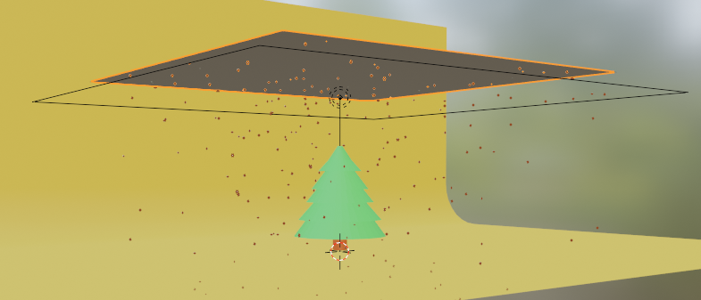

Al plano que lanza nieve le he cambiado el nombre para poder luego identificarlo más fácilmente.


## 3. Configuramos el plano para que emita partículas

Seleccionamos el plano generador de nieve


Le agregamos un particlesystem y configuramos los parámetros necesarios. Yo le he cambiado el nombre con F2 a partículas de nieve para identificarlo.


Configuramos los parámetros necesarios como número de copos, frames de inicio y fin y vida de los copos (cantidad de frames hasta que desaparecen).


Podemos ver la animación (tecla espacio), y veremos el efecto creado. De todos modos, tal como está en el render final no aparecerían las partículas.

## 4. Cambiamos el tipo de emisión para emitir objetos

Elegimos más abajo en **render** elegimos **render as object**.

El objeto tiene un **flag** que indica si el emisor está activo o no. Si se activa un emisor, se empieza a emitir partículas de forma continua, y si se desactiva, se para la emisión. Puede usar esta función para crear efectos de partículas en respuesta a eventos del juego (por ejemplo, una explosión).

En el submenú object seleccionamos en instance object la icosfera que habíamos creado. De este modo, le estamos diciendo que cree todos los objetos a partir de este.


También cambiaremos velocity y physics para ajustar el comportamiento de los copos  y que este sea más realista.

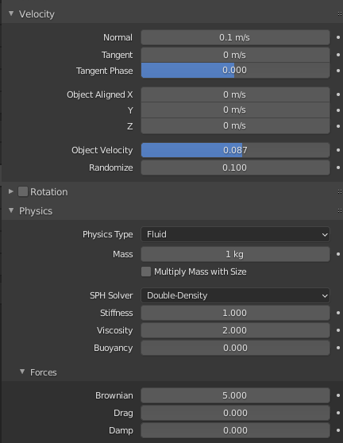

Volved a simular la animación y veréis que ya se comportan más como copos de nieve.


## Colisiones y amortiguación

Al fondo hay que ponerle un modificador de colisión para que las partículas no lo atraviesen.

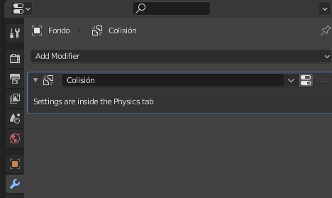

Veréis que los copos rebotan como si fueran canicas, esto se puede modificar. En Physics podéis cambiar el comportamiento para que amortigüe los copos al tocar el suelo.


Ahora los copos ya no atraviesan el plano y no rebotan, sino que se quedan parados en el suelo.


## 6. Iluminación

Vamos a colocar una luz sobre la escena a fin de iluminar correctamente todos los objetos.


## Insertar luz de área

Insertar una **luz de área** que esté justo encima de los objetos que queremos iluminar


## Potencia

Propiedades de la luz. En mi caso le he puesto 1000 W de potencia y me ha parecido  suficiente.

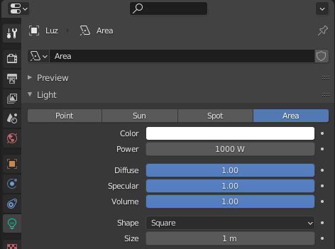

## Altura de la luz

En mi caso he colocado la luz a 12 metros de altura, como referencia, por si lo queréis hacer así, y centrado en origen de coordenadas para la x y la y.


## Cámara

La cámara la podéis poner donde queráis. Yo la he modificado a ojo y en una posición en la que se vea bien la escena.


## Escena final

Aquí podéis ver un resumen de como queda la escena, con todos los elementos.

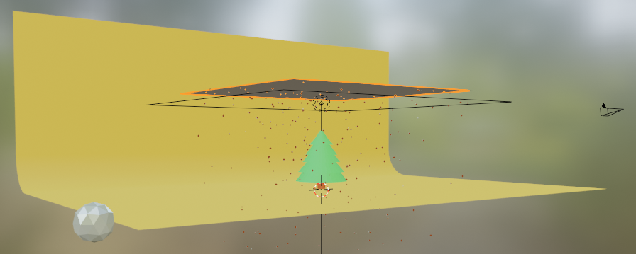
Copo de nieve

Árbol

Cámara

Plano emisor de la nieve

Luz que ilumina la escena

Fondo

Render final


# 8. Crear telón de fondo

## Paso 1: Crear telón

- Creamos un plano con <kbd>shift</kbd> y a continuación malla y plano.
- Escalamos el plano con <kbd>S</kbd>, luego <kbd>2</kbd> ,<kbd>0</kbd> y por último <kbd>++enter++</kbd>. De esta forma tendremos un plano de 20 metros cuadrados
- Seleccionamos en modo arista dos aristas con mismo vértice y las extruimos en el eje Z con <kbd>E</kbd> y luego <kbd>Z</kbd>. Estiramos hacia arriba.
- Por último, seleccionamos las dos aristas que conectan pared y suelos y les hacemos bevel con <kbd>++ctrl++</kbd> + <kbd>B</kbd>

## Paso 2: Crear la luz

- Creamos un plano con <kbd>shift</kbd> y a continuación luz plana.
- La subimos en eje Z unos 5 metros.
- La escalamos a 10 metros cuadrados
- En opciones, le damos una potencia de 10000 Vatios.
