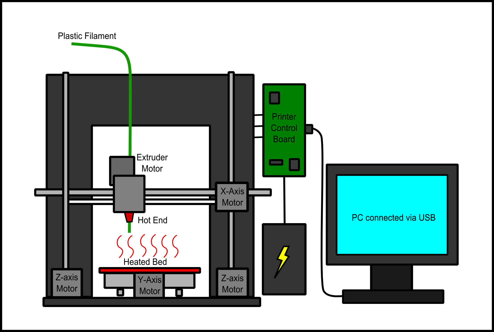

# La impressora 3D

Hi ha diferents tècniques d'impressió 3D. La que treballarem nosaltres és la impressió amb plàstic **PLA**.

La impressora 3D de plàstic imprimeix models creats amb ordinador fonent progressivament **filament** de plàstic sòlid, fent-lo passar per un **extrussor** que el fon i fa que el fil de sortida sigui més prim.

## Motors

Els 3 motors mouen en les 3 dimensions conegudes per a dipositar el filament on correspongui.

- L'extrussor es mou en vertical a l'eix Z i en horitzontal a l'eix X.
- La base es mou en l'eix Y.

Al poc, el plàstic solidifica i s'addereix a la resta de la figura.

## La nostra impresora

La Impresora que tenim és una Prusa I3 Pro W

## El llit

La **base** o **llit** s'encalenteix per a millorar l'adderència del plàstic fus.
El llit es pot escalfar fins 110ºC . Es pot canviar en la configuració. La temperatura s'haurà d'ajustar a el tipus de plàstic utilitzat, ja que cada un té una temperatura diferent de fusió.

