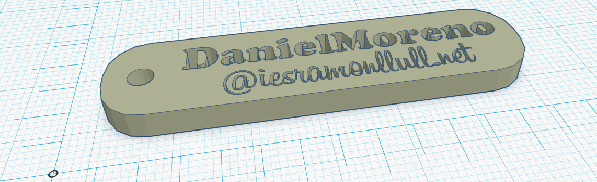
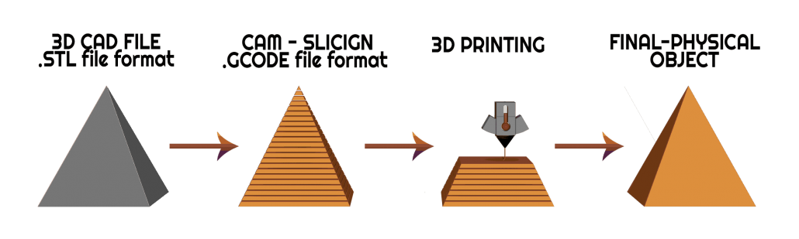

# Crear un model STL

Per a imprimir un objecte amb una impressora 3d necessitem el seu disseny digital en un format d’ arxiu anomenat stl , que és l’estàndard per a la impressió 3d.

La majoria de programes de disseny 3d permeten guardar o exportar els nostres dissenys al format .stl.

Podem fer els dissenys amb programes com ara  _[Tinkercad](https://www.tinkercad.com/)_ .

També podem descarregar models de  _[Thingiverse ](https://www.thingiverse.com/)_ o altres repositoris d’objectes online

