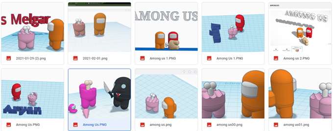
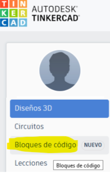
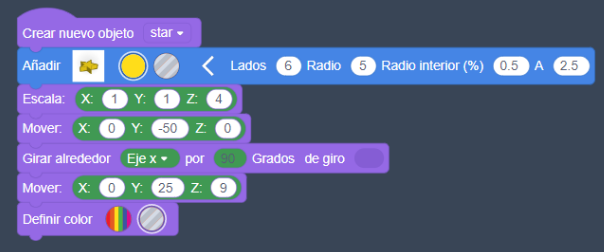

- [Introducción](#introducción)
- [Primeros pasos](#primeros-pasos)
  - [1. Registro de usuario](#1-registro-de-usuario)
  - [2. Proyectos](#2-proyectos)
  - [3. Vídeo primeros pasos](#3-vídeo-primeros-pasos)
  - [4. Acciones](#4-acciones)
    - [Deshacer y rehacer](#deshacer-y-rehacer)
    - [El plano de trabajo](#el-plano-de-trabajo)
    - [Cambiar la perspectiva](#cambiar-la-perspectiva)
  - [Cambiar el plano de trabajo](#cambiar-el-plano-de-trabajo)
  - [5. Figuras](#5-figuras)
    - [Cambiar colores](#cambiar-colores)
    - [Seleccionar figuras](#seleccionar-figuras)
    - [Agrupar figuras](#agrupar-figuras)
    - [Desagrupar figuras](#desagrupar-figuras)
    - [Alinear varias figuras](#alinear-varias-figuras)
    - [Función espejo](#función-espejo)
    - [Colocar Regla](#colocar-regla)
- [Exportar](#exportar)
- [Prácticas](#prácticas)
  - [1. Mesa](#1-mesa)
  - [2. Taza](#2-taza)
  - [3. Llavero](#3-llavero)
  - [4. Among us](#4-among-us)
  - [5. Texto curvado](#5-texto-curvado)
  - [6. Casa](#6-casa)
- [Codeblocks](#codeblocks)
  - [¿Qué podemos hacer con``Tinkercad`` codeblocks?](#qué-podemos-hacer-continkercad-codeblocks)
  - [Patrones](#patrones)
  - [Ejemplo de programa creado con ``Tinkercad`` codeblocks](#ejemplo-de-programa-creado-con-tinkercad-codeblocks)
  - [Colores de bloques](#colores-de-bloques)
  - [Ejemplo](#ejemplo)
  - [Portavelas](#portavelas)
  - [Cohete](#cohete)

# Introducción

Tinkercad es un programa de diseño 3D que permite crear modelos digitales de objetos en tres dimensiones de manera sencilla e intuitiva, sin necesidad de tener conocimientos previos de diseño 3D.

Se puede acceder a él en este enlace: https://www.tinkercad.com/

Con Tinkercad se pueden diseñar objetos desde cero utilizando herramientas de modelado como extrusión, redondeo, fusión, etc. También se pueden importar modelos desde otros programas de diseño y modificarlos en Tinkercad.

Una vez que se ha creado el modelo en Tinkercad, se puede exportar en diferentes formatos para su uso en otros programas o para imprimirlo en una impresora 3D.

# Primeros pasos

## 1. Registro de usuario

En primer lugar, deberéis registraros en **Tinkercad** con una cuenta de usuario, preferiblemente de Google. Una vez registrados, con este usuario se os quedará guardado todo lo que vayáis haciendo en la nube, automáticamente.

Una vez en la página, os deberéis registrar con vuesatra cuenta de google del instituto.

## 2. Proyectos

Cada trabajo que realicéis se guardará como un **proyecto**, que podréis modificar, compartir o exportar para imprimirlo en 3D.

## 3. Vídeo primeros pasos

Aquí tenéis un pequeño vídeo donde os explico brevemente los menús, plano de trabajo, cambiar perspectiva e insertar formas en **Tinkercad**. Por favor, miradlo antes de comenzar con las prácticas porque os ayudará a moveros por el programa.

## 4. Acciones

### Deshacer y rehacer

Como en otros programas, podemos hacer y rehacer cambios: `ctrl+z` y `ctrl+y`

Si mantienes pulsado ``Ctrl`` y aprietas 3 veces ``Z``, desharás 3 acciones.

### El plano de trabajo

Todo lo que hagamos se coloca en el plano de trabajo. Es un plano cuadriculado de color azul. Sobre él colocaremos los objetos. La rejilla tiene un tamaño por defecto de 1mm, que se puede cambiar. Cada cuadrado grande representa 1 cm, y el plano completo ocupa 20 x 20 cm.

### Cambiar la perspectiva

Podemos cambiar nuestro punto de vista del proyecto de varias formas:

- Para moverse alrededor del plano: Botón derecho apretado y mover ratón
- Moverse por el plano: Pulsar rueda central del ratón y arrastrar
- Hacer zoom: ``+`` o ``-``, o rueda del ratón
- Centrar vista en los objetos seleccionados: `f`

## Cambiar el plano de trabajo

Si queremos que un objeto se coloque justo encima de otro, podemos cambiar el plano de trabajo. Con la tecla `w` y luego hacer ``clic botón izquierdo`` en la superficie en la que queremos colocar el plano.

A partir de ahora, las figuras que coloquemos se colocarán encima de este plano.

Para quitarlo, hacemos ``clic botón izquierdo``  en un lugar fuera del plano.

## 5. Figuras

Para colocar una figura en el plano de trabajo, simplemente arrástrala y suéltala en la ubicación deseada.

Para mover una figura, puedes usar las flechas del teclado. Las flechas de dirección mueven la figura seleccionada en los ejes X, Y. Las figuras se mueven de 1 en 1 mm por defecto.

Para mover la figura verticalmente, usa ``Ctrl`` + ``flechas``.

Para mover la figura de 10 en 10 unidades, usa ``Ctrl`` + ``Shift`` + ``flechas``.

### Cambiar colores

Podemos cambiar color y propiedades Alternar entre sólido y hueco (S o H). El color no afecta demasiado porque luego se imprimirá del color del plástico que tengamos.

- Cuando queremos que un objeto no se cambie, podemos bloquearlo con: `ctrl+l`
- Para hacer una copia de la figura, podemos duplicarla: ``ctrl+d``

### Seleccionar figuras

- Seleccionar solo algunas figuras: Mantener `shift` apretado y seleccionar las figuras una a una
- Seleccionar todas: `ctrl+A`

### Agrupar figuras

Para agrupar figuras en Tinkercad, sigue estos pasos:

1. Selecciona las figuras que deseas agrupar. Puedes hacerlo haciendo clic en ellas una a una, o manteniendo presionada la tecla ``Ctrl`` y haciendo ``clic`` en ellas.
2. Presiona ``Ctrl``+``G``.

Las figuras seleccionadas se agruparán en una sola figura.

### Desagrupar figuras

Para desagrupar figuras en Tinkercad, sigue estos pasos:

1. Selecciona la figura que deseas desagrupar.
2. Presiona ``Ctrl``+``Shift``+``G``.

La figura se desagrupará en las figuras individuales que la componen.

### Alinear varias figuras

- (seleccionándolas previamente) con `l`

### Función espejo

La función espejo ``M`` nos permite reflejar o voltear el objeto alrededor de un plano de simetría. Esto puede ser útil para crear objetos simétricos, como un espejo, o para crear objetos con dos mitades iguales, como un zapato.

### Colocar Regla

Pulsando `r` y pulsar dónde queremos colocar la regla en el plano de trabajo. La podemos eliminar o mover cuando queramos

# Exportar

La función de ``exportación`` de Tinkercad te permite guardar tus diseños en una variedad de formatos de archivo. Esto te permite compartir tus diseños con otros, importarlos a otros software o imprimirlos en 3D

Para exportar un diseño de Tinkercad, sigue estos pasos:

1. Preparación: Asegúrate de que tu diseño esté completo y listo para ser exportado. Si tienes partes o componentes que no quieres exportar, selecciónalos y elimínalos.
2. Exportación:
   - Haz clic en el botón Exportar en la parte superior izquierda de la ventana de diseño.
   - Selecciona el tipo de archivo de exportación deseado. Los formatos de archivo compatibles son:
     - ``STL``: El formato de archivo más común para la impresión 3D.
     - ``OBJ``: Un formato de archivo de geometría 3D versátil que es compatible con una amplia gama de software.
     - ``IGES``: Un formato de archivo de geometría 3D estándar que es compatible con muchas aplicaciones CAD.
   - Selecciona una ubicación para guardar el archivo exportado.
Haz clic en el botón ``Exportar``.

# Prácticas

## 1. Mesa

Esta práctica es la más sencilla, y os enseñará a crear cubos, cambiar su tamaño y alinearlos. También, gracias a las formas huecas, podréis crear agujeros en otras figuras.

[Práctica mesa](https://ateneu.xtec.cat/wikiform/wikiexport/cmd/tac/tec3d/tkc/combinant_figures/activitat2)

A continuación, podéis ver algunas ideas de personalización de vuestra mesa que podéis probar en vuestros proyectos:

## 2. Taza

Tenéis que intentar que se parezcan lo máximo posible a la figura original.

Tenéis que insertar un bloque de texto con vuestro nombre (solo nombre) en el modelo, para que se vea que lo habéis hecho vosotros.

Para entregar las tareas deberéis compartir una captura de pantalla en la que se vea la figura que habéis realizado

[Práctica taza](https://ateneu.xtec.cat/wikiform/wikiexport/cmd/tac/tec3d/tkc/combinant_figures/activitat3)

Aquí podéis ver algunos diseños de otros compañeros. Algunos incluso han querido personalizar la taza y adaptarla a su gusto.

## 3. Llavero

Crearemos un llavero utilizando formas de letras y rotaciones.

[Práctica llavero](https://ateneu.xtec.cat/wikiform/wikiexport/cmd/tac/tec3d/tkc/text/activitat2)

Ejemplos de compañeros de cursos anteriores:

## 4. Among us

En esta práctica, recreamos a un personaje del juego Among us. Tenéis el vídeo al tutorial aquí:

[Video práctica among us](https://www.youtube.com/watch?v=KgViNud47fE)

Aquí podéis ver los diseños de otros alumnos:

## 5. Texto curvado

Vamos a intentar crear un texto curvo en``Tinkercad``.

[Video crear texto curvo](https://www.youtube.com/watch?v=30tn86dEHfs)

## 6. Casa

En la siguiente práctica crearemos una composición con varios objetos: una casa, una carretera, un árbol y un coche.

[Práctica casa](https://drive.google.com/file/d/1QY-08gttksRK3UdrgNvRzCraS9H-mU6C/view?usp=sharing)

# Codeblocks

``Tinkercad codeblocks`` nos permite crear diseños figuras en 3 dimensiones a partir de objetos simples en 3 dimensiones, combinándolos de diferentes formas.

Estos diseños se pueden automatizar mediante **bloques de programación**, de un modo similar a scratch.

Un programa es un conjunto de instrucciones, como una receta. Estas instrucciones le dicen a la computadora qué hacer. Los informáticos diseñan nuevos programas informáticos, estudian y resuelven problemas y crean nuevas formas de utilizar la tecnología.

## ¿Qué podemos hacer con``Tinkercad`` codeblocks?

Tinkercad **codeblocks**, también llamados «bloques de código» nos permite utilizar bloques de programación. Esto es especialmente útil cuando queremos reproducir ciertos patrones muchas veces.

## Patrones

Los **patrones** son diseños que se repiten o secuencias de elementos recurrentes. Estos patrones no tienen que ser siempre exactos, sino que pueden ir variando en cada repetición.

Si suponemos que tenemos unos conocimientos mínimos de cómo se crea un programa, los elementos más importantes que debemos tener en cuenta son:

- Los **bucles** o loops, que me permiten repetir una acción todas las veces que quiera
- Las **variables**, que pueden contener información que puedo cambiar cuando quiera

## Ejemplo de programa creado con ``Tinkercad`` codeblocks

Aquí podemos ver un ejemplo de programa. En lugar de escribir texto, nos dan unas «piezas» o **bloques** ya creados que se pueden conectar entre ellas, como si de un puzzle se tratara, al estilo de **scratch**.

Se lee el programa y se siguen las instrucciones de arriba a abajo, una por una (a excepción de los bucles u otras estructuras de control)

## Colores de bloques

Los colores identifican el tipo de pieza de la que se trata. En este ejemplo:

- Los violetas son movimientos
- Los verdes son variables, que se pueden poner en ciertos «huecos» que hay en otros bloques.
- Los azules colocan nuevas piezas
- Los naranjas son bucles o estructuras que cambian el orden normal del programa, u hacen que se repitan ciertas acciones.

## Ejemplo

Una vez diseñado el programa lo podemos arrancar e irá creando el diseño que nosotros le hayamos dicho, paso por paso, hasta terminar todas las instrucciones.

Podemos cambiar incluso la velocidad, e ir parando el programa en cualquier momento para poder ver cómo se va desarrollando. Si algo no nos gusta o no funciona, podemos cambiar instrucciones o valores de variables y volver a ejecutarlo.

## Portavelas

En este ejemplo crearemos un cilindro, lo vaciaremos por dentro y crearemos un patrón de estrellas con la finalidad de crear agujeros a lo largo y ancho del objeto.

El código es todo completo, lo he tenido que cortar en trozos para poder mostrarlo todo.

**Paso 1. Creamos el cilindro**

**Paso 2. Creamos el objeto estrella**

**Paso 3. Patrón circular**

**Paso 4. Patrón rectangular estrella**

**Paso 5. Juntarlo todo**

Al agrupar los objetos sólidos y huecos, se harán los agujeros dentro del cilindro. Por último, eliminaremos los objetos que hemos utilizado para crear esta nueva figura.

## Cohete

En este caso, deberéis diseñar un cohete en``Tinkercad`` mediante bloques de código.

Aquí tenéis el enlace al video:

[Video práctica cohete](https://youtu.be/aylClFbwyGM)

Seguid los pasos del vídeo e intentad entender la lógica del programa.

Si tenéis alguna duda, preguntad.
