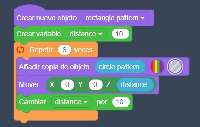

# Portavelas

En este ejemplo crearemos un cilindro, lo vaciaremos por dentro y crearemos un patrón de estrellas con la finalidad de crear agujeros a lo largo y ancho del objeto.

El código es todo completo, lo he tenido que cortar en trozos para poder mostrarlo todo.

## Paso 1. Creamos el cilindro

## Paso 2. Creamos el objeto estrella

## Paso 3. Patrón circular

## Paso 4. Patrón rectangular estrella

## Paso 5. Juntarlo todo

Al agrupar los objetos sólidos y huecos, se harán los agujeros dentro del cilindro. Por último, eliminaremos los objetos que hemos utilizado para crear esta nueva figura.
