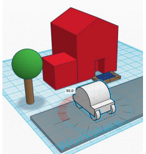

# 6. Casa

En la siguiente práctica crearemos una composición con varios objetos: una casa, una carretera, un árbol y un coche.

[Práctica casa](https://drive.google.com/file/d/1QY-08gttksRK3UdrgNvRzCraS9H-mU6C/view?usp=sharing)