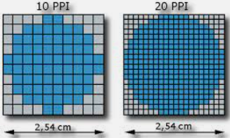

# 3. Resolución

La resolución de una imagen es la cantidad de píxeles que la describen. En general la resolución la determina el área en píxeles, calculado como el producto entre los píxeles de ancho y los píxeles de alto.

- La imagen de la izquierda tiene una resolución de 10x10 píxels.
- La imagen de la derecha tiene una resolución de 20x20 píxels.

Para el mismo área, la imagen que tiene más píxels tiene más definición.

## Densidad de píxeles

Suele medirse en términos de "píxeles por pulgada" (**ppp**) y de ella depende tanto la calidad de la representación como el tamaño que ocupa en memoria el archivo gráfico generado. En inglés estas unidades se llaman **ppi**.

La imagen de la izquierda tiene menos resolución (menos píxels) que la de la derecha. Al ocupar las dos imágenes el mismo área, la de la derecha tiene más densidad de píxels.

La medida de una imagen son las dimensiones reales en términos de anchura y aura una vez impresas. 
Por ejemplo: Una imagen con una resolución de 20 ppp se imprime con una configuración de 300x200 píxeles. Dará un tamaño de imagen:

- **Horizontal**: 300píxeles/75 ppp = 4,17pulgadas x 2,54 cm/pulgada= 10,59 cm
- **Vertical**: 200píxeles/75 ppp = 2,78pulgadas x 2,54 cm/pulgada= 7,06 cm

La resolución óptima que debe tener una imagen para imprimir es de 300 ppp

En cuanto al tamaño de la imagen en un monitor, depende de la configuración del monitor.

## Ejemplo

Por ejemplo, en un monitor de 15 pulgadas con la configuración típica de 800 píxeles horizontales y 600 verticales, una imagen con dimensiones de 800 x 600 píxeles llenaría toda la pantalla. En un monitor de 17 pulgadas con un ajuste, también, de 800 x 600 píxeles, la misma imagen volvería a llenar la pantalla, pero cada uno de los píxeles tendría un tamaño mayor. Si se camba la configuración de este segundo monitor a 1024 x 768 píxeles, la imagen se mostraría en un tamaño más pequeño, sin llegar a ocupar toda la pantalla.
Mira este	ejemplo,	verás	como una	imagen con la	misma	dimensión	en	píxeles	es mostrada de forma distinta en un mismo monitor con configuraciones distintas.

El tamaño o medida de una imagen son sus dimensiones reales en términos de anchura y aura una vez impresa, mientras	que el	tamaño del archivo	se	refiere	a	la	cantidad	de memoria	física	necesaria	para almacenar la información de la imagen digitalizada en cualquier soporte informático de almacenamiento.

Lógicamente la	resolución	de	la	imagen condiciona	grandemente	estos	dos conceptos.	Puesto	que el número de píxeles de una imagen digitalizada es fio, al aumentar el tamaño de la imagen reducimos la resolución y viceversa.

Cuando pretendemos que una aplicación que manipule imágenes digitalizadas mantenga el tamaño de las mismas pero aumente la resolución la estamos "obligando" a que se "invente" píxeles y, en determinados casos, puede provoca que la imagen final así manipulada tenga una calidad más pobre que la original originada en pérdida de datos o desenfoque de la ilustración.

Reducir la resolución de la imagen, manteniendo su tamaño, ocasiona la eliminación de píxeles y por lo tanto, una descripción menos precisa de la misma junto a unas transiciones de color más bruscas. 

El tamaño del archivo que genera una imagen digitalizada es proporcional, lógicamente, a su resolución, por lo tanto, modificando ésta estamos modificando, en el mismo sentido el tamaño del archivo.