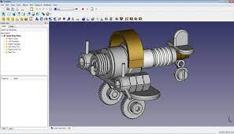
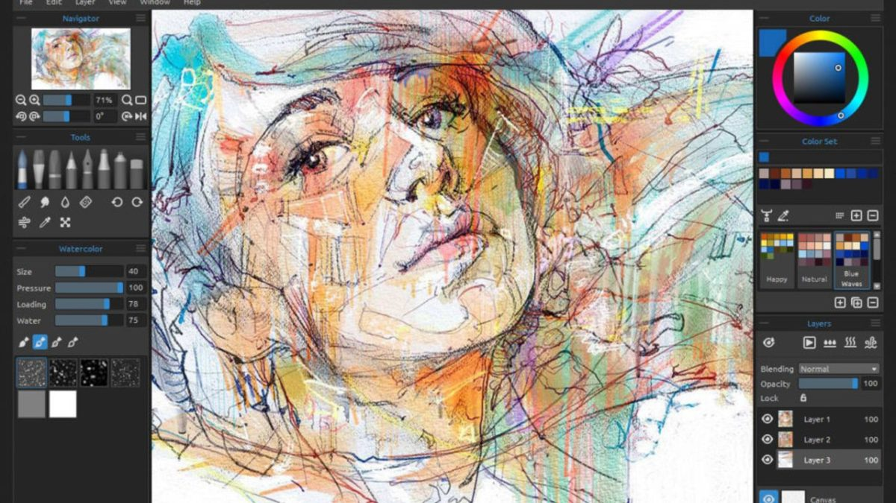

# 9. EDICIÓN DE IMÁGENES DIGITALES

## Software de tratamiento de imágenes

El software de tratamiento de imágenes ofrece diversas herramientas y aplicaciones para visualizar, editar y crear imágenes. A continuación, se detallan algunas de las principales categorías y ejemplos de programas y aplicaciones disponibles:

## Visualizadores de imágenes

Los visualizadores de imágenes permiten ver y organizar colecciones de imágenes. Algunos ejemplos de visualizadores populares son:

- Software libre: GIMP
- Software privativo: Photoshop, Paint Shop Pro, Irfan View, XnView

## Fotos en la nube

Existen plataformas en la nube donde se pueden almacenar y gestionar fotos, como:

- Google Photos
- iCloud
- Flickr

## Herramientas CAD

Las herramientas CAD (Computer-Aided Design) son aplicaciones utilizadas en campos como la arquitectura e ingeniería para crear dibujos técnicos en 2D y 3D. Algunos ejemplos de herramientas CAD son:

- Software privativo: AutoCAD, CATIA
- Software libre: FreeCAD, LibreCAD

## Ilustración

La ilustración digital es una forma de creación artística utilizando herramientas especializadas. Algunos programas populares para ilustración son:

- Software libre: Inkscape, Krita
- Software privativo: Adobe Illustrator, CorelDRAW

Existen varias aplicaciones para iPad que son ideales para la ilustración. A continuación, te presento algunas opciones populares:

- Procreate: Considerada una de las mejores aplicaciones de ilustración para iPad, Procreate ofrece una amplia gama de herramientas y funciones profesionales. Permite trabajar con capas, pinceles personalizables, animación y tiene una interfaz intuitiva.

- Adobe Illustrator: La versión para iPad de Adobe Illustrator brinda la capacidad de crear ilustraciones vectoriales precisas y escalables. Permite trabajar con una amplia variedad de herramientas y tiene una integración fluida con Adobe Creative Cloud.

- Autodesk SketchBook: Es una aplicación de ilustración digital con una amplia gama de pinceles y herramientas para crear dibujos y bocetos. Ofrece opciones de capas, simetría, estabilización de trazos y soporte para lápices sensibles a la presión.

## Edición y montaje

La edición y el montaje de imágenes son procesos comunes en el tratamiento de imágenes. Aquí hay algunos programas utilizados para estas tareas:

- Software libre: GIMP, Blender
- Software privativo: Photoshop, Corel PaintShop Pro
