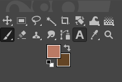
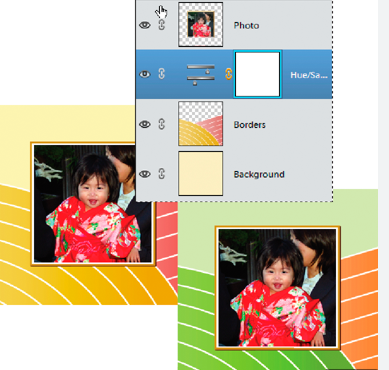
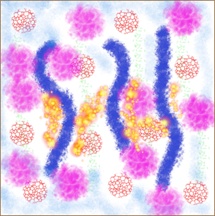
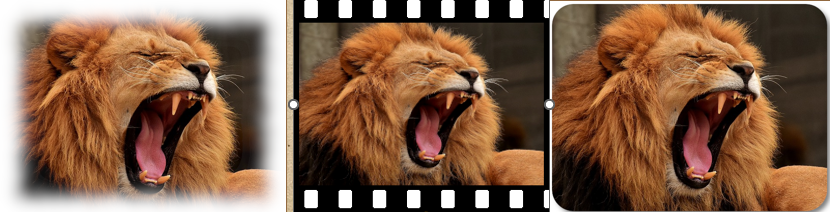
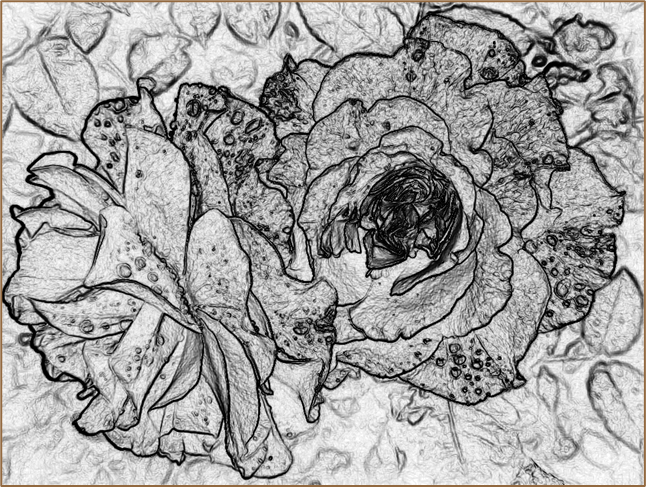
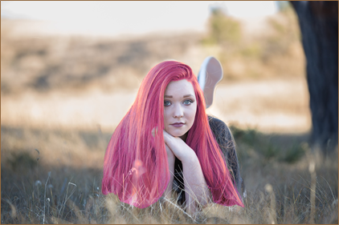
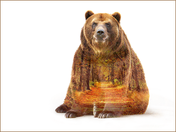
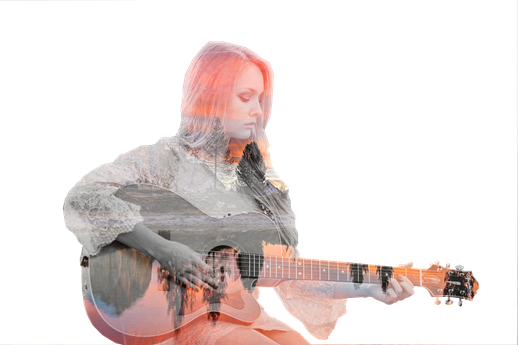
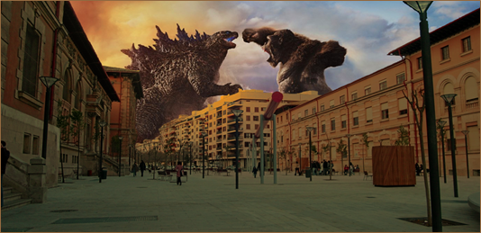

- [1. Introducción](#1-introducción)
  - [¿Qué es ``GIMP``?](#qué-es-gimp)
  - [Instalar ``GIMP``](#instalar-gimp)
- [2. Trabajo con archivos](#2-trabajo-con-archivos)
  - [Crear imagen](#crear-imagen)
  - [Guardar](#guardar)
  - [Abrir imagen](#abrir-imagen)
  - [Formatos de imagen XCF](#formatos-de-imagen-xcf)
  - [Exportar](#exportar)
- [3. Herramientas de dibujo](#3-herramientas-de-dibujo)
  - [Colores](#colores)
  - [La caja de herramientas](#la-caja-de-herramientas)
  - [Cuadros de color](#cuadros-de-color)
  - [Opciones de Herramientas](#opciones-de-herramientas)
- [4. Zoom y movimiento](#4-zoom-y-movimiento)
  - [Zoom](#zoom)
  - [Mover](#mover)
- [5. Herramientas de selección](#5-herramientas-de-selección)
  - [Seleccionar partes de la imagen](#seleccionar-partes-de-la-imagen)
  - [Seleccionar regiones rectangulares](#seleccionar-regiones-rectangulares)
  - [Quitar selección](#quitar-selección)
  - [Seleccionar diferentes zonas](#seleccionar-diferentes-zonas)
  - [Quitar una parte de la selección](#quitar-una-parte-de-la-selección)
  - [Selección contigua](#selección-contigua)
  - [Selección por color](#selección-por-color)
  - [Rutas](#rutas)
  - [Herramienta recoge-color :](#herramienta-recoge-color-)
  - [Máscara rápida](#máscara-rápida)
- [6. Herramientas de transformación](#6-herramientas-de-transformación)
  - [Recortar](#recortar)
  - [Rotar](#rotar)
  - [Escalar (modificar el tamaño de la imagen, de una selección o ruta)](#escalar-modificar-el-tamaño-de-la-imagen-de-una-selección-o-ruta)
  - [Mover (M)](#mover-m)
  - [Herramienta transfomación unificada](#herramienta-transfomación-unificada)
  - [Crear capturas de pantalla](#crear-capturas-de-pantalla)
- [7. Capas](#7-capas)
  - [Capas en ``GIMP``](#capas-en-gimp)
  - [Zonas transparentes](#zonas-transparentes)
  - [Qué podemos hacer](#qué-podemos-hacer)
  - [Ordenar capas](#ordenar-capas)
  - [Modo de capa (también se le llama modo de fusión)](#modo-de-capa-también-se-le-llama-modo-de-fusión)
    - [Visibilidad de la capa.](#visibilidad-de-la-capa)
    - [Capa enlazada](#capa-enlazada)
    - [Mover capas](#mover-capas)
- [Prácticas](#prácticas)
  - [Herramientas de pintura](#herramientas-de-pintura)
  - [Filtros](#filtros)
  - [Dibujo artístico](#dibujo-artístico)
  - [Máscara de capa](#máscara-de-capa)
  - [Máscara rápida](#máscara-rápida-1)
  - [Doble exposición](#doble-exposición)
  - [Herramientas selección difusa, capas e iluminación](#herramientas-selección-difusa-capas-e-iluminación)
  - [Miniaturas de vídeos](#miniaturas-de-vídeos)

# 1. Introducción

## ¿Qué es ``GIMP``?

**``GIMP``** es una aplicación adecuada para la edición y composición de imágenes así como para el retoque fotográfico. Esta herramienta es gratuita y representa una excelente opción frente a otros programas comerciales como Adobe PhotoShop.

## Instalar ``GIMP``

Para instalar ``GIMP`` en vuestro ordenador, tenéis que ir a este enlace: https://www.gimp.org/downloads/

# 2. Trabajo con archivos

Para trabajar podemos crear un archivo nuevo, o bien abrir otro archivo ya existente.

## Crear imagen

++ctrl+++N

## Guardar

++ctrl+++S

## Abrir imagen

++ctrl+++O

## Formatos de imagen XCF

Puedes guardar tus progresos sobre una imagen en el formato nativo de **xcf**. De este modo se guardan las capas y preferencias por separado, y siempre podremos seguir editando el archivo desde Gimp.

## Exportar

Si queremos poder compartir y ver el archivo fuera de Gimp, tenemos que exportar el archivo a un formato de imagen, como **jpg, gif o png**.

# 3. Herramientas de dibujo

Tenemos diferentes herramientas de dibujo, como por ejemplo:

- Lápiz N
- Pincel P
- Goma de borrar Shift+E
- Texto T

## Colores

## La caja de herramientas

La siguiente ventana que vamos a ver es **La Caja de Herramientas**. Es el corazón de Gimp y la ventana más importante. No se puede duplicar ni borrar (obviamente, esto cerraría Gimp). En ella se encuentran la mayoría de herramientas de Gimp

## Cuadros de color

Bajo las herramientas , los cuadrados negro y blanco, muestran el **color de fondo y frente** seleccionado, pinchando dos veces sobre cualquiera de ellos, se accede al diálogo para seleccionar un nuevo color, lo mismo con el otro.

## Opciones de Herramientas

Es un diálogo empotrable, en este caso está empotrada a la Caja de Herramientas, te permite configurar distintos parámetros de la herramienta seleccionada

# 4. Zoom y movimiento

## Zoom

Alejarnos o acercarnos con **++ctrl++ + rueda** (ratón). Otros zooms rápidos son:

- 1 para tamaño real
- 2,3,4,5 para doble, triple, etc.

Otras opciones:

- Centrar imagen con **shift + J**

## Mover

- Mover M
- Pulsando la rueda del ratón también podemos mover

# 5. Herramientas de selección

## Seleccionar partes de la imagen

Crear selecciones nos permite decidir sobre qué parte de la imagen queremos actuar. Se pueden hacer con diferentes formas:

- Rectangular: R
- Elipse: E

## Seleccionar regiones rectangulares

Hacemos clic y arrastramos con el ratón hasta
marcar la zona que queremos seleccionar.
Si presionamos:

- **++ctrl++** después de hacer clic este punto se convertirá en el centro de la selección.
- **Mayús** para hacer la selección será cuadrada

Si queremos hacer un documento nuevo con una capa o selección que hayamos copiado,
pinchamos en el menú Editar - Pegar como – Imagen nueva.

## Quitar selección

Para quitar la selección: **Seleccionar – Nada**

Al marcar la casilla de verificación difuminar los bordes, con el radio de difuminación señalamos la zona que queremos quede difuminada.

## Seleccionar diferentes zonas

Pulsando la tecla ++shift++y seleccionando las siguientes. De esta forma podemos copiar y pegar varias zonas separadas como si se tratase de una sola. Esta función también se puede realizar con las otras herramientas de selección.

## Quitar una parte de la selección

Pulsamos **++ctrl++**  y marcamos posteriormente la zona que queremos quitar

## Selección contigua

Cuando se hace clic sobre la imagen se seleccionan los píxeles contiguos más similares por color al pixel sobre el que se ha hecho clic.

- El umbral de selección se determina en opciones de herramienta. A veces es más fácil seleccionar zonas por tener un color
parecido que hacerlo con la herramienta de mano alzada.
- Para ir sumando zonas recordad que hay que pulsar **Mayús**.

## Selección por color

Selecciona zonas que tienen el mismo color al pixel sobre el que se ha hecho clic, aunque no sean contiguas.

- varita mágica U

## Rutas

Podemos crear una **ruta a partir de líneas rectas y curvas** que podemos modificar hasta que se adapten a nuestra área y posteriormente la convertimos en selección pulsando **return** sobre la zona.

## Herramienta recoge-color :

Capta el color a partir del pixel de la imagen que marquemos.

## Máscara rápida

En la esquina inferior izquierda de la ventana imagen tenemos un icono (cuadrado con línea discontinua) que nos permite activar la máscara rápida.

Cuando lo pinchamos toda la imagen se llena de un color rojizo, lo que hemos hecho es poner una máscara que nos permita poder borrar zonas para que luego se conviertan en zona seleccionada.

Para ello utilizamos la goma de borrar eliminando la zona de máscara que queremos que sea la selección.

Cuando finalizamos volvemos a hacer clic sobre el icono de máscara rápida que se ha convertido en un cuadrado de línea continua rojo y ya obtenemos la selección.

# 6. Herramientas de transformación

## Recortar

Para ello hacemos clic en una esquina de la zona a recortar y, manteniendo pulsado el botón izquierdo del ratón, lo arrastramos en diagonal
para formar un marco de selección y haciendo enter sobre el mismo obtenemos la imagen
recortada.

## Rotar

Para girar la imagen completa elegimos la herramienta y se hace clic sobre la imagen. Para
comenzar a rotarla mantenemos pulsado el botón del ratón sobre la imagen y la arrastramos.

Aparece el cuadro de diálogo Rotar, que especifica el ángulo de rotación (una cifra positiva indica
un giro de la imagen en el sentido de las agujas del reloj; una cifra negativa un giro de la imagen
en sentido antihorario de las agujas del reloj) y el punto sobre el que gira la imagen. Se puede
modificar el centro de giro arrastrando el círculo con una cruz que aparece al centro de la imagen
o por medio del cuadro de diálogo (centro X y centro Y).
También se puede ajustar la rotación modificando el ánguo en el cuadro de diálogo.Para que rote la figura hacemos clic en el botón
Rotar.
- Podeos limitar los giros a intervalos de 15º y seleccionando imagen – transformar, podemos girar la imagen 90o o 180o.

## Escalar (modificar el tamaño de la imagen, de una selección o ruta)

Para ello hacemos clic sobre la imagen, con lo que aparece cuadro de diálogo
Redimensionar mostrando las medidas de la imagen en píxeles.

- Escalar la imagen de forma proporcional se mantiene presionada la tecla ++ctrl++ mientras se arrastra alguno de los cuadraditos
que enmarcan la imagen en las esquinas de la misma.
Cuando se tiene la imagen como se desea, se pincha n el botón Escala.

Una vez escalada la imagen, queda un espacio libre representado por cuadrados grises a modo de tablero de ajedrez que indican transparencia.
Otra forma de redimensionar una imagen consiste en pinchar en Imagen - Escalar la imagen y ahí introducimos nuevas medidas. Comprobará que, cuando introduce una cifra para variar la
medida de Anchura o Altura la otra cambia para mantener la proporcionalidad de la imagen. Si
se desea introducir medidas no proporcionales debe hacer clic en el icono con forma de cadenas
que se encuentra a la derecha de Anchura y Altura. Aparecerán entonces los eslabones separados
y podrá introducir las cifras de forma independiente.

La diferencia mediante esta forma de escala es que con esta última se cambia también el tamaño del lienzo mientras que con la anterior se
escala el contenido de la imagen (no cambia el tamaño del lienzo). El escalado de las imágenes

Página 8

siempre (si se puede) debe hacerse a la baja y no al alza. Digamos que una imagen “va bien de
grande a pequeña y mal de pequeña a grande”, ya que en este caso pierde mucha nitidez.
Con las herramientas inclinar , perspectiva y voltear podemos respectivamente
inclinar, cambiar la perspectiva o voltear horizontal o verticalmente una imagen o selección de la
misma. En voltear cuando giramos una selección nos crea una capa flotante, que para
transformarla en una capa normal, tenemos que ir a la ventana de capas y situándonos sobre la
capa flotante pinchar con el botón derecho en nueva capa.

## Mover (M)

Para mover una selección, hay que cortar la misma, a continuación pegarla y posteriormente moverla.

## Herramienta transfomación unificada

Permite realizar en una única herramienta acciones como rotar, inclinar, escalar o corregir la perspectiva.

## Crear capturas de pantalla

Para realizar capturas de pantalla, la opción más sencilla es ir a Archivo – Crear – Captura de
pantalla y elegir si queremos toda la pantalla o solo la ventana activa.

Desde el portapapeles, pulsando la tecla **Impr pant** si queremos capturar toda la pantalla o **alt + Impr pant** si sólo queremos la ventana activa. Posteriormente pincharíamos en Archivo – Crear –

# 7. Capas

Las ``capas`` son como transparencias puestas unas encima de otras. La parte que no está rellena
en una capa deja ver el contenido de la capa de debajo.

Las capas nos permiten tener partes de la composición separadas, y solo trabajar sobre las que queremos, sin afectar a las demás.

## Capas en ``GIMP``

Para trabajar en ``GIMP`` con capas, disponemos de varios atajos:

- Para abrir el diálogo de capas: ++ctrl+++L
- Abrir una imagen de un archivo como capa: ++ctrl+++Alt+O
- Pegar como capa: ++ctrl++ +++shift+++ V
- Combinar capas visibles: ++ctrl+++M

## Zonas transparentes

Las zonas que parecen un tablero de ajedrez formadas por cuadraditos grises indican transparencia.

## Qué podemos hacer

- Una capa puede ser borrada, duplicada, combinada con otras.
- A una capa se le puede cambiar el tamaño de forma independiente
- Se pueden mover, se les puede cambiar el orden de apilación, etc.
- También permiten distintos grados de transparencia.

## Ordenar capas

En la ventana de capas, los botones de la parte inferior de izquierda a
derecha, sirven para:

- Crear una capa nueva, subir la capa seleccionada
- Bajar la capa seleccionada, duplicar la capa activa, anclar la capa, añadir
una máscara, borrar la capa activa.

## Modo de capa (también se le llama modo de fusión)

Debe haber por lo menos 2 capas para que se pueda aplicar. Cambia la apariencia de una capa según la capa o capas que están por debajo.

- **Bloqueo de transparencia** Sirve para poder rellenar una capa (con un
color sólido o un patrón) o una parte de ella sin que afecte a las zonas
transparentes de la misma.
- **Control de la opacidad** Se puede establecer la transparencia de la capa
desplazando el botón deslizante o introduciendo directamente el porcentaje
de opacidad deseado en el cuadro de texto.
- **Nombre de la capa** Sirve para identificar la capa (es útil cuando una imagen está compuesta por muchas capas). Puede modificarse haciendo doble clic sobre el nombre de cada capa.
- **Capa seleccionada** Se encuentra coloreada e indica que lo que hagamos en la ventana imagen surtirá efecto en ella.

### Visibilidad de la capa.

Si el **ojo** está visible vemos la capa en la ventana imagen. Si hacemos clic
sobre el ojo, éste desaparece y la capa deja de estar visible en la ventana imagen.

### Capa enlazada

Este icono (que se activa y desactiva haciendo clic sobre él) permite la transformación agrupada de todas las capas que están enlazadas. Lo que hagamos afectará a todas las capas marcadas con este símbolo

### Mover capas

Con varias imágenes abiertas, en la ventana de capas se puede:

- Arrastrar y llevar capas de unas imágenes a otras.
- Se puede hacer con copiar y pegar como capa nueva.

# Prácticas

## Herramientas de pintura

## Filtros

## Dibujo artístico

## Máscara de capa

## Máscara rápida

## Doble exposición

## Herramientas selección difusa, capas e iluminación

## Miniaturas de vídeos