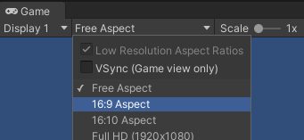

# Cambiar resolución

Vamos a cambiar la ``resolución`` por la típica que se utiliza en pantallas que es la **16:9**.

---

# Cambiar el layout

Podemos personalizar también la disposición de las ventanas en nuestro editor. Elegiremos la disposición ``2 by 3``.

---