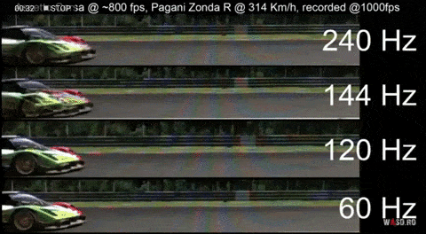

[游댗 Enrere](../) | [游 P많ina principal](http://danimrprofe.github.io/apuntes/)

# Frecuencia de refresco

La frecuencia de refresco de un monitor se refiere a la cantidad de veces por segundo que se actualiza la imagen en la pantalla del monitor. Se mide en ``Herzios`` (Hz) y determina la fluidez con la que se muestran las imágenes en el monitor.

Por ejemplo, si un monitor tiene una ``frecuencia de refresco`` de 60Hz, significa que la imagen se actualiza 60 veces por segundo.

Las pantallas están programadas para cambiar lo que se muestra en pantalla a una frecuencia determinada. Es decir, para 60 Hz la pantalla modifica lo que muestra 60 veces por segundo.

Esto tiene una importancia enorme, puesto que no se pueden mostrar más FPS que la frecuencia de refresco de la pantalla. Si está a 60 Hz, no podrá por ejemplo mostrar 120 FPS, solo 60. Por lo que no notaremos diferencia en calidad.

