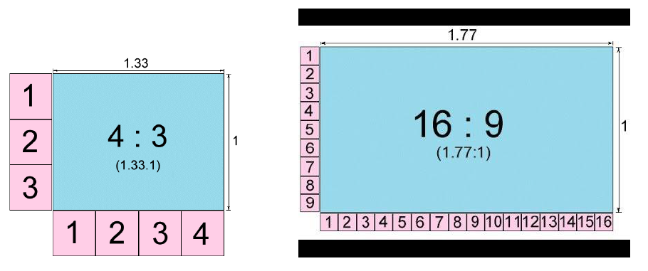
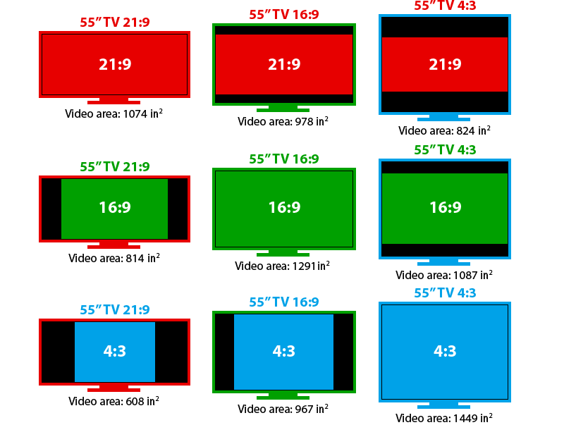

[🔙 Enrere](../) | [🏠 Pàgina principal](http://danimrprofe.github.io/apuntes/)

# Relació d'aspecte

## ¿Qué es?

La ``relació d'aspecte`` en pantalles es refereix a la proporció entre l'amplada i l'alçada de la pantalla. És una mesura important a considerar quan es selecciona una pantalla per a un propòsit particular, ja que la relació d'aspecte afecta la forma en què es mostren les imatges i els vídeos en la pantalla.

## Relacions més habituals

Algunes de les relacions d'aspecte més comuns són:

- ``4:3``: Aquesta relació d'aspecte és típica de les pantalles més antigues i és amplament utilitzada en la transmissió de televisió estàndard i en presentacions d'oficina.
- ``16:9``: Aquesta relació d'aspecte és la més comuna en les pantalles modernes i és àmpliament utilitzada en televisors, ordinadors portàtils i monitors de PC. És la relació d'aspecte preferida per als continguts de vídeo d'alta definició (HD) i 4K.
- ``21:9``: Aquesta relació d'aspecte s'utilitza principalment en pantalles d'ultra ampla i en monitors per a jocs i entreteniment. Aquesta relació d'aspecte és més ampla que la 16:9 i permet als espectadors veure més contingut horitzontalment.

<https://www.youtube.com/watch?v=z_VtxrKolZU>
