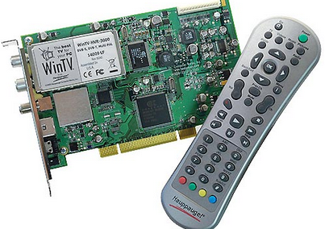

# 11. Evolución hacia el streaming

## Televisión en España

En 1956 nace Televisión Española (TVE), que comenzó emitiendo un único canal público en abierto.
En 1965 se creó la Segunda Cadena (TVE2).

## Canales autonómicos

A partir de 1982 comenzaron a aparecer los canales autonómicos.

## 1986. Vídeo VHS

El consumo de vídeo en forma de películas se realizó a través de reproductores de VHS y cintas de vídeo que se podían alquilar en un videoclub y/o comprarlas. También se podía grabar la señal de televisión en cintas grabables.

## Cadenas privadas

En los años 90 entraron en escena nuevas cadenas privadas como Telecinco y Antena 3.

# 1990. Canales de pago

En 1990 comienza a emitir Canal+, el primer canal codificado de pago en España.

# 1997. Televisión por satélite

También en los años 90 se inició la emisión de televisión por satélite en España a través de plataformas como Vía Digital y Canal Satélite Digital, para lo cual se requería la instalación de una antena parabólica y un receptor específico.

## Emisión de canales a través de la conexión a Internet

En ordenadores no se veía prácticamente televisión, a no ser que se utilizase una tarjeta de expansión de TV.

Mucho más tarde aparecieron las primeras películas y juegos en DVD y, posteriormente, en Blu-Ray.
