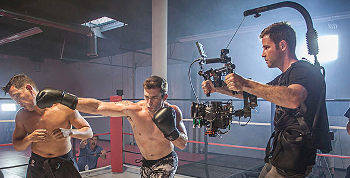
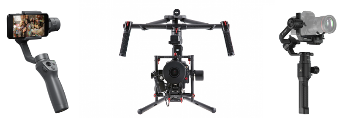

# Estabilización

Un problema habitual en vídeo que no encontramos en fotografía es el de la estabilización. Conforme nos movemos, hay vibraciones, etc. El vídeo refleja esos movimientos y la calidad se resiente.

## Steadycams

Antiguamente se empleaban estabilizadores, aunque hoy en día los móviles suelen tener programas internos que, utilizando el sensor de giro, corrigen la imagen para que se vea estable.

## Gimbal

A modo profesional, se utilizan unos soportes llamados **gimbal**, que incorporan un mecanismo que hace que la cámara siempre esté en la misma posición, aunque nos movamos nosotros.

