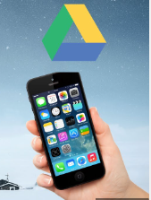

# Guardado y organización

## Guardado

Una vez lo tengamos todo grabado, guarda todos los vídeos en un ordenador o en la nube, y haz copias para tenerlo guardado por si hubiera algún problema.

## Traspaso por whatsapp

Tened en cuenta que, si compartís fotografías o vídeos a través de ``WhatsApp`` o RRSS, estos archivos perderán calidad puesto que se comprimen antes de enviarlas, por lo que no es lo recomendable.

## USB

También puedes conectar el móvil al PC con un cable para buscar los vídeos y extraerlos por USB.

## Compartir directamente

Puedes subir los vídeos directamente a ``YouTube`` o alguna red social sin necesidad de editarlo o tras editarlo directamente en el móvil.

## Google drive

También puedes subirlos a Dropbox o Google drive, para poder descargarlos desde el ordenador.

## Organización

Organiza los videos en carpetas, con diferentes nombres, como harías con otros documentos. De esta forma, será más fácil encontrarlos luego cuando hagas la edición.

