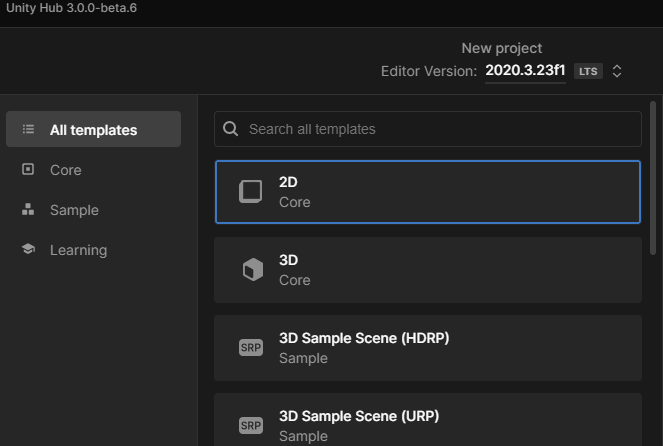

## Crear un proyecto

---

### Abrimos unity

Ahora mismo tenemos instalados dos programas: el Hub, y el Unity editor en sí (color negro). Este es el que tenemos que abrir.

---

### Carga de unity

Se nos abre la pantalla de carga de ``Unity``.

---

Finalmente veremos la ``pantalla de proyectos``, desde la que podremos abrir un proyecto existente o crear un proyecto nuevo.

---

### Información de proyectos existentes

Podemos observar los proyectos, la carpeta en la que se guarda el proyecto, así como la ``versión del editor`` con el que ha sido creado el proyecto.

---

### Plantillas

Existen diferentes ``plantillas`` de proyecto que podemos utilizar y que vienen configuradas con diferentes opciones, según el tipo de juego que queramos hacer,

---

### Crear nuestro proyecto

En nuestro caso vamos a utilizar la plantilla ``2D core`` y le ponéis el nombre que queráis.

Arriba podréis elegir la versión del editor con la que vais a crear el proyecto.

---