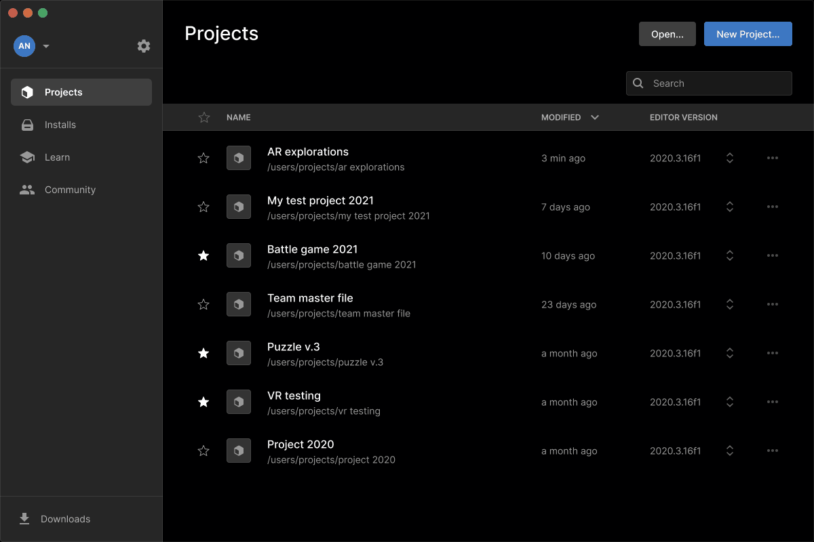

## Instalación y configuración

Para instalar necesitaremos seguir los siguientes pasos:

1. Descargar ``unity hub`` desde la página oficial: https://unity.com/download
2. Crear un ``usuario`` de unity
3. Instalar el ``editor de unity``

---

### Unity Hub

En primer lugar nos descargaremos el ``Unity hub``, una aplicación desde la que podremos gestionar las instalaciones y actualizaciones de todos los programas relacionados con Unity. También se nos mostrarán los proyectos que tenemos creados.

---

---

### Cuenta de usuario

Para gestionar nuestras instalaciones, necesitaremos crear una cuenta de usuario de ``Unity``, que deberemos crear para poder iniciar sesión y trabajar en nuestros proyectos.

---

### Editor de Unity

Posteriormente, instalaremos el ``editor de unity``, que nos permitirá crear nuestros juegos.

---