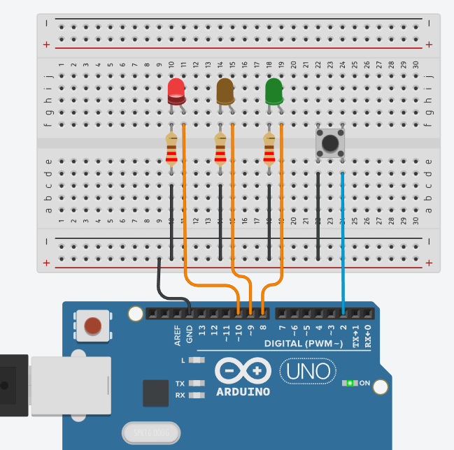

# Semáforo con pulsador

En este ejemplo, el semáforo estará siempre en rojo, a no ser que pulsemos el botón. En ese caso, el semáforo pasará a verde, luego a ámbar y, por último, a rojo.

## Conexiones

Elegiremos 3 pines a los que colocar los LED, en mi caso 8, 9 y 10. Los 3 LED tendrán una resistencia en el camino, para protegerlos.

Tanto los LED como el pulsador se conectaran por la otra patilla hacia la entrada GND (tierra).


El pulsador irá conectado a otro pin, en mi caso he elegido el 2.




## Código del programa

```c
int ledVerde = 8;
int ledAmarillo = 9;
int ledRojo = 10;

int boton = 2;

void setup()
{
  pinMode(ledVerde, OUTPUT);
  pinMode(ledAmarillo, OUTPUT);
  pinMode(ledRojo, OUTPUT);

  pinMode(boton, INPUT_PULLUP);

  digitalWrite(ledRojo, HIGH);
}

void loop()
{
  if (digitalRead(boton) == LOW){
    delay(1000);
  	//Encender verde
  	digitalWrite(ledVerde, HIGH);
  	digitalWrite(ledAmarillo, LOW);
  	digitalWrite(ledRojo, LOW);
  	delay(5000);
  	//Encender amarillo
  	digitalWrite(ledVerde, LOW);
  	digitalWrite(ledAmarillo, HIGH);
  	digitalWrite(ledRojo, LOW);
  	delay(2000);
  	//Encender rojo
  	digitalWrite(ledVerde, LOW);
  	digitalWrite(ledAmarillo, LOW);
  	digitalWrite(ledRojo, HIGH);
  	delay(5000);
  }
}
```