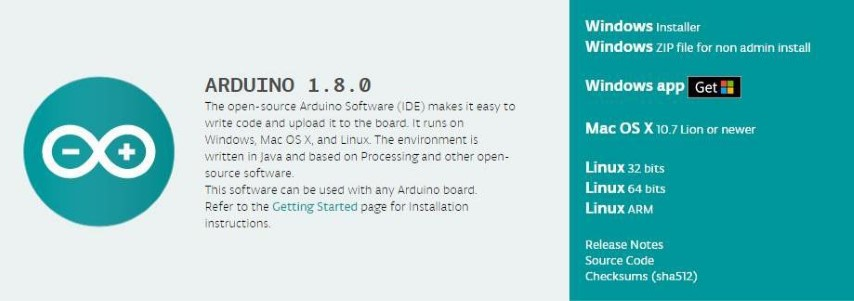
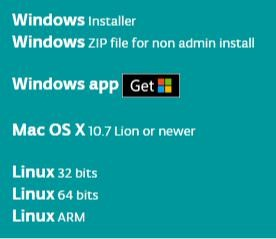
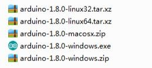
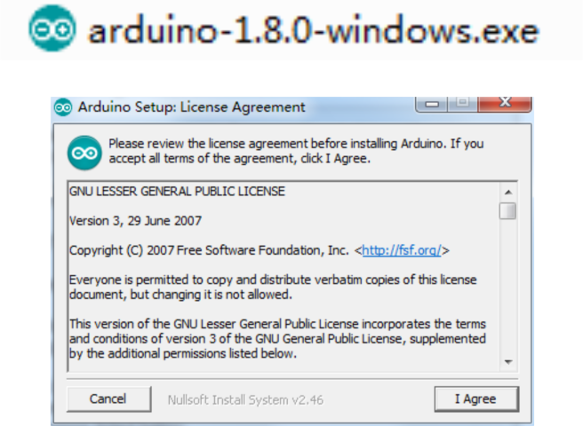
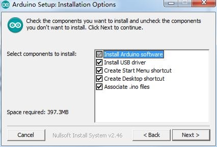
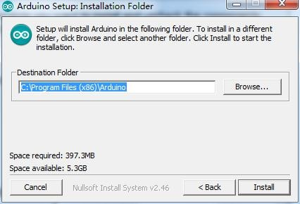
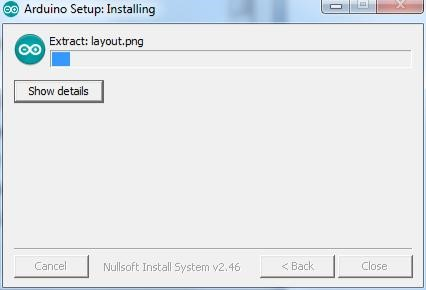
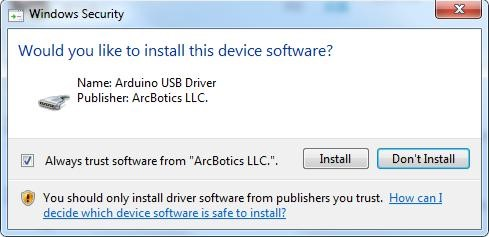
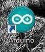

[🔙 Enrere](../) | [🏠 Pàgina principal](http://danimrprofe.github.io/apuntes/) \n\n---
title: Instalación
footer: Daniel Moreno 🌐 <github.com/danimrprofe>
_footer: ""
paginate: true
_paginate: false
marp: true
---

# Instalación IDE

---

## Introducción

El **Entorno de desarrollo integrado (IDE) de``Arduino``** es el software de la plataforma``Arduino``. En esta lección, usted aprenderá cómo configurar tu ordenador para usar``Arduino`` y cómo establecer sobre las lecciones que siguen.

---

## Instalación

Paso 1: Ir a https://www.arduino.cc/en/Main/Software y a continuación de la página.

La versión disponible en este sitio web es generalmente la última versión y la versión actual puede ser más reciente que la versión en el cuadro.

---

Paso 2 : Descargar el desarrollo software que es compatible con el sistema operativo del ordenador. Windows tomar como un ejemplo aquí

---

Haga click en Windows Installer.

Haga click en DESCARGAR (JUST DOWNLOAD).

---

También está disponible en el material que nos proporciona la versión 1.8.0, y las versiones de nuestros materiales son las últimas versiones cuando se hizo este manual.

---

## Instalación de``Arduino`` (Windows)

---

Instalar``Arduino`` con el exe. Paquete de instalación.

---

Haga click en I Agree to see de esta ventana

---

Click Next

---

Puede pulsar examinar... elegir una ruta de instalación o directamente en el directorio que desee.

---

Haga Click en Install para comenzar la instalación

---

Por último, aparece la siguiente ventana, haga clic en Install para finalizar la instalación.

---

A continuación, aparece el siguiente icono en el escritorio

---

Haga doble clic para entrar en el entorno de desarrollo deseado

---

## Conexión de placa``Arduino``

La carpeta de``Arduino`` incluye el propio **programa de``Arduino``** y los **controladores** que permiten que el``Arduino`` se conecte al ordenador mediante un cable USB.

Conecte su cable **USB** en el``Arduino`` y en el USB ordenador.

---
