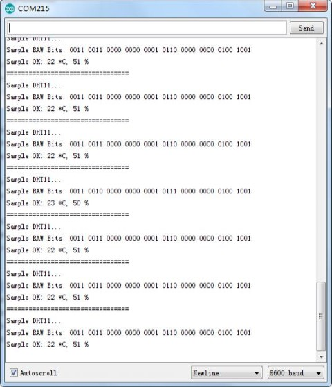

[游댗 Enrere](../) | [游 P많ina principal](http://danimrprofe.github.io/apuntes/)

# Sensor humedad temperatura DHT11

## Resumen

En este tutorial vamos a aprender cómo usar un sensor de humedad y temperatura **DHT11**. El sensor digital de temperatura y humedad **DHT11** es un sensor que nos proporciona información de  de la temperatura y la humedad.


## Componentes necesarios

|     |                                              |
|  | -- |
| (1) | Placa arduino  |
| (1) | módulo de humedad y temperatura DHT11        |
| (3) | F M cables (cables de hembra a macho DuPont) |

## Parámetros del sensor

Cualquier magnitud que queramos leer tendrá unas ``características`` de precisión, según el sensor o instrumento que lo mide.

# Humedad relativa

- Resolución: 16 bits
- Repetibilidad: ±1% H.R.
- Precisión: 25 ° C ±5% hr
- Intercambiabilidad: intercambiables
- Tiempo de respuesta: 1 / e (63%) de 25º c 6s
- 1m / s de aire 6s
- Histéresis: < ± 0.3% RH
- Estabilidad a largo plazo: < ± 0.5% hr / año en

## Temperatura

|                      |                 |
| -------------------- | --------------- |
| Resolución:          | 16 bits         |
| Repetibilidad:       | ±0. 2 ° C       |
| Rango:               | 25 ° C ±2° c    |
| Tiempo de respuesta: | 1 / e (63%) 10S |

## Características eléctricas

Para funcionar, el sensor necesita corriente eléctrica.

|                         |                                |
| ----------------------- | ------------------------------ |
| Fuente de alimentación: | DC 3.5 ~ 5.5V                  |
| Corriente:              | medición 0.3mA (60μA en espera |
| Periodo de muestreo:    | más de 2 segundos              |

# Descripción de pines

El sensor dispone de 3 pines para recibir corriente eléctrica y comunicarse con la placa arduino. Estos pines son:


|      |                                                    |
| ---- | -------------------------------------------------- |
| VDD  | Lo conectaremos a 5 V                              |
| DATA | Lo conectaremos a un pin de datos. En este caso D2 |
| GND  | Lo conectaremos a tierra                           |


## Código

El siguiente código va a utilizar el sensor que hemos conectado para leer la temperatura y la humedad que está midiendo el sensor.

```c title="sensorHumedadytemperatura.ino"
#include <dht_nonblocking.h>
#define DHT_SENSOR_TYPE DHT_TYPE_11

static const int DHT_SENSOR_PIN = 2;
DHT_nonblocking dht_sensor( DHT_SENSOR_PIN, DHT_SENSOR_TYPE );

void setup( )
{
  Serial.begin( 9600);
}

static bool medir ( float *temperature, float *humidity )
{
  static unsigned long measurement_timestamp = millis( );

  /* Measure once every four seconds. */
  if( millis( ) - measurement_timestamp > 3000ul )
  {
    if( dht_sensor.measure( temperature, humidity ) == true )
    {
      measurement_timestamp = millis( );
      return( true );
    }
  }

  return( false );
}

void loop( )
{
  float temperature;
  float humidity;

  if( medir( &temperature, &humidity ) == true )
  {
    Serial.print( "T = " );
    Serial.print( temperatura, 1 );
    Serial.print( " deg. C, H = " );
    Serial.print( humedad, 1 );
    Serial.println( "%" );
  }
}
```

## Salida en el monitor

Los valores medidos se mostrarán por pantalla en el monitor serie. El monitor serie lo tenemos que abrir desde el IDE de arduino.


A continuación se nos abrirá una pantalla en la que podremos ver los datos que nuestro programa está escribiendo.


