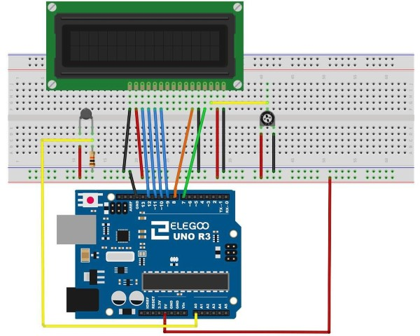

[游댗 Enrere](../) | [游 P많ina principal](http://danimrprofe.github.io/apuntes/)

# Termómetro

---

## Resumen

En esta lección, utilizaremos una pantalla LCD para mostrar la temperatura.

---

## Componentes necesarios

> * Elegoo Uno R3
> * LCD1602 Módulo
> * x resistencia de ohmio 10 k
> * x termistor
> * x potenciómetro> *
> * x 830 tie puntos Breadboard
> * x M M cables (cables de puente de macho a macho)

## Termistor

Un **termistor** es un resistor térmico - un resistor que cambia su resistencia con la temperatura. Técnicamente, los resistores son termistores - sus cambios de resistencia con temperatura - pero el cambio es generalmente muy pequeño y difícil de medir.

---

## Tipos de termistores

Hay dos clases de termistores:

- NTC (coeficiente de temperatura negativo)
- PTC (coeficiente positivo de temperatura).

En general, usaremos sensores **NTC** para medir la temperatura.

---


---



---

## Código

Antes de ejecutar esto, asegúrese de que ha instalado la **librería** <LiquidCrystal> o volver a instalarlo, si es necesario. De lo contrario, el código no funcionará.

Es útil poner una línea de comentario sobre el comando 'lcd'.

BSED4D5D6D7

LiquidCrystal lcd (7, 8, 9, 10, 11, 12);

Esto facilita las cosas si decides cambiar que utilizas los pernos.

En la **función loop** ahora hay dos cosas interesantes sucediendo. En primer lugar tenemos que convertir la analógica del sensor de temperatura una temperatura real, y en segundo lugar tenemos que encontrar la manera a los mismos.

---

En primer lugar, echemos un vistazo a cálculo de la temperatura.

```c
int tempReading = analogRead(tempPin);
doble tempK = log (10000.0 * ((1024.0/tempReading - 1)));
tempK = 1 / (0.001129148 + (0.000234125 + (0.0000000876741 * tempK * tempK)) * tempK);
float tempC = tempK - 273.15;
floatfloat tempF = (tempC * 9.0) / 5.0 + 32.0;
```

---

Cambio lecturas se muestra en una pantalla LCD puede ser complicado. El principal problema es que la lectura puede no ser siempre el mismo número de dígitos. Por lo tanto, si la temperatura cambia de 101,50 a 99.00 entonces el dígito adicional de la lectura antigua es en peligro de quedar en la pantalla.

---

Para evitar esto, escriba la línea de la pantalla LCD cada vez el bucle.

```c
lcd.setCursor (0, 0);
LCD.Print ("Temp C");
lcd.setCursor (6, 0);
LCD.Print(tempF);
```

---

El comentario bastante extraño sirve para recordarles de las 16 columnas de la pantalla. Luego puede imprimir una cadena de esa longitud con espacios donde irá la lectura real.


Para rellenar los espacios en blanco, establecer la posición del cursor por donde la lectura debe aparecer y luego imprimirlo.
