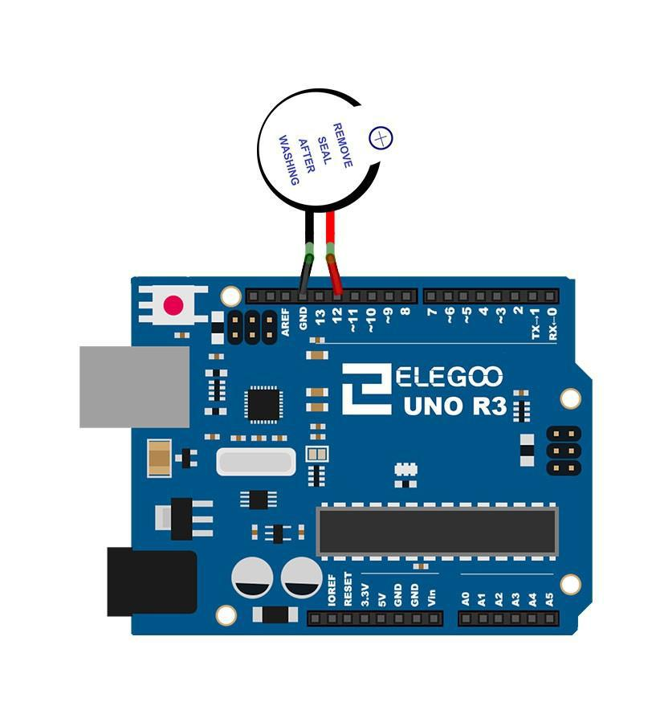

[游댗 Enrere](../) | [游 P많ina principal](http://danimrprofe.github.io/apuntes/)

# Zumbador activo

## Resumen

En esta lección, aprenderá a generar un sonido con un timbre activo.
Componente necesario:

| Cantidad | Componente                 |
| -------- | -------------------------- |
| 1        | Placa``Arduino``           |
| 1        | zumbador activo            |
| 2        | Cables jumper macho hembra |

## Esquema de conexión


## Diagrama



## Montaje


## Código

Jugando con los retardos (delay) conseguiremos frecuencias de sonido distintas.

```c
int buzzer = 12; //pin del zumbador
void setup()
{
 pinMode(buzzer,OUTPUT); //configurar como salida
}
void loop()
{
 unsigned char i;
 while(1)
 {
   //output an frequency
   for(i=0;i<80;i++)
   {
    digitalWrite(buzzer,HIGH);
    delay(1);//wait for 1ms
    digitalWrite(buzzer,LOW);
    delay(1);//wait for 1ms
    }
    //output another frequency
     for(i=0;i<100;i++)
      {
        digitalWrite(buzzer,HIGH);
        delay(2);//wait for 2ms
        digitalWrite(buzzer,LOW);
        delay(2);//wait for 2ms
      }
  }
}
```
