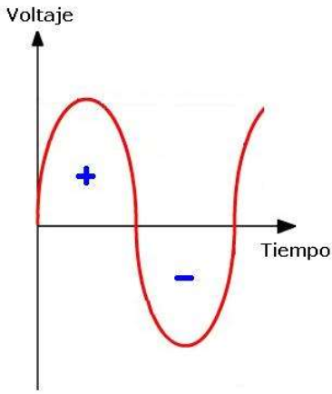

# Corriente alterna y corriente continua

* _Corriente continua \(CC o DC\)_
  * La corriente continua es un flujo continuo de electrones de un lado a otro con un sentido determinado\.
  * Ese flujo irá del polo negativo al polo positivo\.
* _Corriente alterna \(CA o AC\)_
  * Varía su valor desde 0 a un valor máximo  y luego disminuye hasta llegar a 0\.
  * Posteriormente cambia de sentido y  decrece desde 0 hasta un valor mínimo y  aumenta hasta llegar a 0\.

