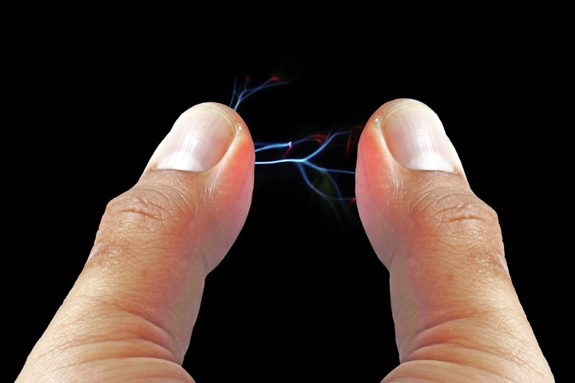
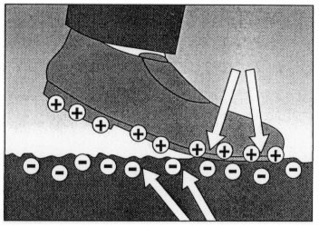

# Electricidad estática

Se produce cuando se acumulan cargas eléctricas en un objeto \( frotar la lana  contra el plástico \)\.

Puede ser nefasta en el momento del  ensamblado de un equipo\.

Hay que descargarse bien antes de  realizar cualquier operación de  ensamblado o mantenimiento de un equipo tocando objetos metálicos\.

