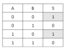
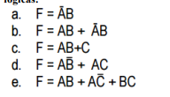
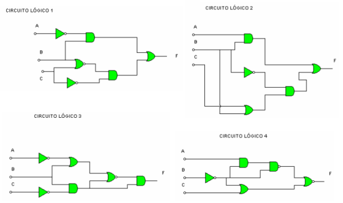

# Simulación de circuitos

Vamos a comprobar como podemos comprobar el funcionamiento de un circuito sin necesidad de construirlo físicamente. Para ello, utilizaremos la siguiente página web:

https://logic.ly/demo/

## Obtener la función lógica a partir de una tabla

## Calcular la tabla de verdad de un circuito

A partir de la siguiente función, crea el circuito correspondiente:

## Hallar la función lógica del siguiente circuito

