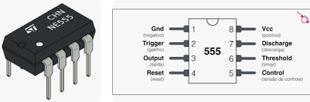
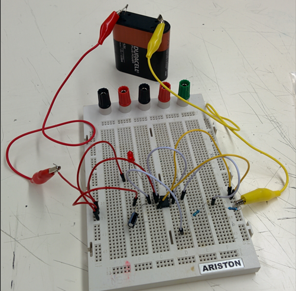
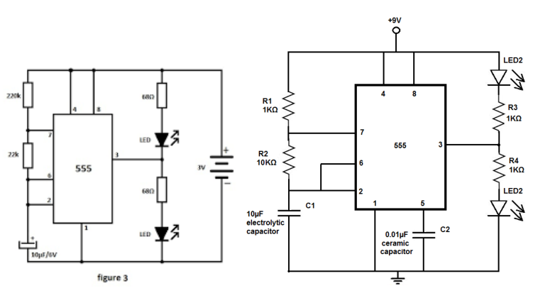

# Integrado 555

El CI 555 es un circuito integrado de temporizador que se utiliza comúnmente en proyectos electrónicos. Fue diseñado por Hans R. Camenzind en 1971 y desde entonces ha sido uno de los chips integrados más populares en el mundo de la electrónica debido a su bajo costo, facilidad de uso y versatilidad.

El CI 555 se puede utilizar en una variedad de aplicaciones, como temporizadores, alarmas, osciladores, reguladores de voltaje, convertidores de frecuencia, entre otros.

## Circuito Led parpadeando

## Sonidos

## Flash alterno

