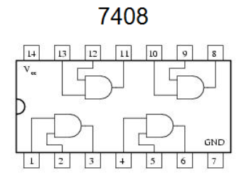

## 6. Circuitos integrados

En tiendas de electrónica podemos comprar **circuitos integrados** con varias puertas lógicas en su interior, cuyas entradas y salidas se pueden conectar a través de las patillas para formar cualquier circuito.

Por ejemplo, este circuito integrado tiene en su interior cuatro puertas del tipo AND.

