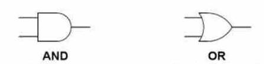
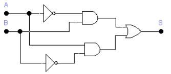
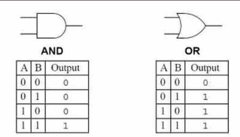

# Electrònica digital

Hemos visto algunos componentes utilizados en los circuitos de electrónica analógica (resistencias, condensadores, diodos, etc.), esta tecnología se caracteriza porque las señales físicas (temperatura, sonido, imagen, etc.) se convierten en una señal eléctrica para poder realizar un circuito que controle una calefacción, un ventilador, una bombilla, etc.

En electrónica digital sólo existen dos niveles de tensión:

- 0 voltios (que se representa mediante el número 0)
- 5 voltios (que se representa con el número 1)

PoUna señal digital sólo puede tener dos valores, 0 y 1.

## Operaciones lógicas

En el álgebra de Boole existen tres operaciones lógicas básicas:

- AND
- OR
- NOT

## Puertas lògicas

La **puerta lógica** es el bloque de construcción básico de los sistemas digitales. Cada puerta lógica tiene un símbolo que lo identifica. Constan de dos o más **entradas** (A, B, C) y una **salida** S.

A la izquierda tenemos las entradas, y a la derecha las salidas.

Juntando varias puertas lógicas y conectándolas entre ellas, podemos diseñar el sistema digital que nosotros necesitemos.

## Tabla de verdad

En un circuito digital, las operaciones se pueden resumir en una **tabla de verdad**. La tabla de verdad contiene todas las combinaciones de entradas posibles, y las salidas que mostrarán a la salida de la puerta.

En puertas de dos entradas, tendremos un total de 4 combinaciones de ceros y unos.

- La puerta AND implementa la operación lógica AND, que muestra un valor 1 a la salida si las dos entradas valen 1.
- La puerta OR en cambio corresponde a la operación lógica OR, que muestra 1 si alguna de las entradas está a 1.

## Diseño de un circuito

En un montaje real, una puerta lógica será un circuito electrónico que proporciona señales
digitales en su salida cuando a sus entradas se le aplican también señales digitales. Las señales de
salida dependen de las señales de entrada.

Todos los sistemas digitales se pueden construir utilizando tres puertas lógicas básicas. Estas son las puertas AND, la puerta OR y la puerta NOT. Existen otro tipo de puertas que se obtienen combinando las anteriores. De este tipo son las puertas NAND, NOR, XOR y XNOR.

## 5. Circuito lògico

Una vez obtenida y simplificada (si se puede) la función lógica, el siguiente paso es obtener el
circuito lógico con puertas lógicas correspondiente, para por último efectuar el montaje. Para ello
tendremos en cuenta lo siguiente:

- Un producto de la función lógica equivale a una puerta AND.
- Una suma equivale a una puerta OR.
- Cuando una entrada aparece negada, equivale a la misma entrada sin negar pero conectada a
una puerta inversora NOT.

Sigamos con el ejemplo de la silla de atracción de feria para ver su circuito lógico equivalente,
recordando que su función lógica es la siguiente:

S = A·B + A·B

El circuito lógico equivalente será:

## 6. Circuitos integrados

En tiendas de electrónica podemos comprar **circuitos integrados** con varias puertas lógicas en su interior, cuyas entradas y salidas se pueden conectar a través de las patillas para formar cualquier circuito.

Por ejemplo, este circuito integrado tiene en su interior cuatro puertas del tipo AND.

