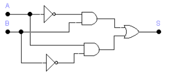

# Electrònica digital

## Operacions lògiques

## Circuits amb portes lògiques

1. Fer operacions lògiques emprant l’àlgebra de Boole en la resolució de problemes tecnològics senzills.
1.1. Fa operacions lògiques emprant l’àlgebra de Boole.
1.2. Relaciona plantejaments lògics amb processos tècnics.
2. Resoldre problemes tecnològics senzills mitjançant portes lògiques.
2.1. Resol problemes tecnològics senzills mitjançant portes lògiques.
3. Analitzar sistemes automàtics i descriure’n els components.
3.1. Analitza sistemes automàtics i en descriu els components.
4. Muntar circuits senzills.
4.1. Munta circuits senzills.

## 4. Puertas lògicas

La puerta lógica es el bloque de construcción básico de los sistemas digitales. Constan de
dos o más entradas (A, B, C) y una salida S. Las puertas lógicas operan con números binarios. En los
circuitos digitales una tensión alta significa un 1 binario y una tensión baja significa un cero binario
(lógica positiva).
En un montaje real, una puerta lógica será un circuito electrónico que proporciona señales
digitales en su salida cuando a sus entradas se le aplican también señales digitales. Las señales de
salida dependen de las señales de entrada.
Todos los sistemas digitales se pueden construir utilizando tres puertas lógicas básicas.
Estas son las puertas AND, la puerta OR y la puerta NOT.
Existen otro tipo de puertas que se obtienen combinando las anteriores. De este tipo son las
puertas NAND, NOR, XOR y XNOR.
El funcionamiento de un circuito digital se refleja en su TABLA DE VERDAD, donde
representamos las entradas del circuito (A, B, C) y las salidas (normalmente una llamada S).
Se representan todas las posibles combinaciones de entrada en orden. Recordar que con 2
entradas hay 4 combinaciones posibles, con 3 entradas existen 8 combinaciones posibles, con n
entradas existen 2
n
combinaciones.
Puertas elementales: OR, AND y NOT.

El funcionamiento de cada una de estas puertas se puede comprender fácilmente observando la
equivalencia con el circuito de interruptores. El interruptor abierto simboliza la entrada a nivel 0,
mientras que el nivel 1 corresponde con el interruptor cerrado, es decir, a 5 voltios.
Según la tabla de la verdad, para la puerta OR existe salida cuando el interruptor A o B está
cerrado. La bombilla permanecerá apagada cuando ambas entradas estén abiertas o lo que es lo
mismo a nivel cero.

## 5. Circuito lògico

Una vez obtenida y simplificada (si se puede) la función lógica, el siguiente paso es obtener el
circuito lógico con puertas lógicas correspondiente, para por último efectuar el montaje. Para ello
tendremos en cuenta lo siguiente:

- Un producto de la función lógica equivale a una puerta AND.
- Una suma equivale a una puerta OR.
- Cuando una entrada aparece negada, equivale a la misma entrada sin negar pero conectada a
una puerta inversora NOT.

Sigamos con el ejemplo de la silla de atracción de feria para ver su circuito lógico equivalente,
recordando que su función lógica es la siguiente:

S = A·B + A·B

El circuito lógico equivalente será:

## 6. Circuitos integrados

- CIRCUITOS INTEGRADOS FAMILIA TTL.
Cuando diseñamos un sistema digital, el último paso es realizar el montaje práctico con puertas
lógicas. Recordar que en un montaje real, una puerta lógica será un circuito electrónico que
proporciona señales digitales en su salida cuando a sus entradas se le aplican también señales
digitales. Las señales de salida dependen de las señales de entrada.
Los circuitos integrados se realizan utilizando transistores. Existen distintas tecnologías de
fabricación, de las cuales la más empleada es la lógica TTL (Transistor Transistor Logic). Se emplea
por su rapidez y por su alimentación a 5 voltios de corriente continua.
El circuito integrado se designa con el código 74 (indicativo de la familia TTL) seguido de dos o
tres números que identifican el tipo de puerta o bloque que lleva en su interior